# TransitFlow Database Design

## Overview

PostgreSQL with the TimescaleDB extension, running as a Docker container alongside the MQTT broker. Stores time-series crowd count data, edge device logs, model version metadata, admin activity, GTFS-RT trip updates, prediction engine output, and scheduler decisions.

Images are **not** stored by the database. A future dedicated module will subscribe to `edge/+/image` via MQTT and manage its own filesystem storage.

## Architecture

Two data paths feed the database: **MQTT** (crowd counts from edge devices or the crowd simulator via BrokerHandler) and **GTFS-RT** (vehicle positions from the NTA API via the GTFS-RT fetcher). The PredictionEngine reads from the database (via SnapshotBuilder) to produce predictions and scheduling alerts -- it does not subscribe to MQTT directly.

> **Note:** During demos, the **Crowd Count Simulator** (`src/Simulator/`) replaces edge devices. It publishes identical `edge/{id}/crowdCount` and `edge/{id}/status` MQTT messages for 587 stops across 12 Dublin Bus routes, using the same `device_id` = GTFS `stop_id` mapping. The BrokerHandler and database cannot distinguish simulator data from real edge data.

```mermaid
flowchart LR
    EdgeDevices["Edge Devices\nor Simulator"]
    MQTTBroker["Mosquitto Broker"]
    BrokerHandler["BrokerHandler"]
    DBWriter["DatabaseWriter"]
    TimescaleDB["TimescaleDB"]
    GTFSRTFetcher["GTFS-RT Fetcher"]
    NTAAPI["NTA API"]
    SnapshotBuilder["SnapshotBuilder\n(future)"]
    PredEngine["PredictionEngine"]
    EvalRegistry["EvaluatorRegistry"]
    Scheduler["Scheduler (future)"]
    ImageModule["Image Module (future)"]

    EdgeDevices -->|MQTTS| MQTTBroker
    MQTTBroker -->|"crowdCount, status, log, model"| BrokerHandler
    MQTTBroker -->|"edge/+/image"| ImageModule
    BrokerHandler --> DBWriter
    DBWriter --> TimescaleDB
    NTAAPI -->|"protobuf feed"| GTFSRTFetcher
    GTFSRTFetcher -->|"trip updates"| TimescaleDB
    TimescaleDB -->|"RouteSnapshot"| SnapshotBuilder
    SnapshotBuilder --> PredEngine
    PredEngine -->|"RoutePredictionResult"| EvalRegistry
    EvalRegistry -->|"Alert"| Scheduler
    PredEngine -->|"predictions"| TimescaleDB
    EvalRegistry -->|"scheduler_decisions"| TimescaleDB
```



## Design Decisions

| Decision | Choice | Rationale |
|----------|--------|-----------|
| Image storage | Not in DB | A future dedicated module will subscribe to `edge/+/image` and manage its own filesystem. Keeps the DB lean. |
| Model storage | Metadata only | Model `.pt` files stay on the filesystem. DB stores filename, hash, size, path, and active/inactive status. |
| Real-time API data | GTFS-RT | Vehicle positions and trip updates from the NTA API, polled every 60s. Includes `direction_id` for per-direction filtering. Schema includes JSONB `raw` column for full entity storage. |
| DB writer pattern | Separate `DatabaseWriter` module | BrokerHandler calls into `DatabaseWriter` -- clean separation of MQTT handling from persistence logic. |
| Retention policy | Keep all data | No compression or deletion policies for now. Can be added later via TimescaleDB retention policies. |
| Log table strategy | Single `stop_logs` hypertable | All devices in one table, filtered by `device_id`. TimescaleDB's time-based chunking already provides efficient per-device queries. Simpler schema, easier cross-device queries, no dynamic table creation needed. |
| Current count access | Separate `current_counts` table with `previous_count` | One row per device with the latest count + previous count for trend/delta. Keeps `stops` as stable metadata, isolates high-frequency telemetry. Dashboard crowding hotspots derive delta directly without querying the hypertable. |
| Route/stop mapping | `routes` + `route_stops` tables | Static GTFS data (116 bus routes + 2 LUAS lines). `route_stops` stores ordered stop sequences per route per direction. Enables route-based dashboard filtering and prediction engine route-walking. |
| Vehicle tracking | `vehicles` table with current state | Modeled after prototype's Vehicle (state machine: ARRIVING/PRESENT/DEPARTING). Stores current position, passenger count, occupancy. Updated by GTFS-RT and Scheduler. |
| Predictions | Per-vehicle-per-stop predictions | Captures "vehicle V at stop S will have N passengers" with boarding, alighting, and data coverage fields. Populated by PredictionEngine's sequential simulation. Hypertable for historical analysis. |
| Scheduler decisions | Typed decision log with trigger context | Records what triggered each decision (which vehicle, which stop, what predicted occupancy, what threshold). Enables audit trail and decision analytics. |
| System alerts | Separate `system_alerts` table | Internally generated alerts (threshold breaches, device offline, prediction warnings). Separate from GTFS-RT service alerts. Dashboard merges both for AlertBar. |
| Vehicle history | `vehicle_telemetry` hypertable | Time-series snapshots of vehicle state for fleet utilization charts. `vehicles` table is current-state only. |
| `stop_id` resolution | Writer caches `device_id -> stop_id` mapping | MQTT payloads only include `device_id`. Writer resolves `stop_id` from a cached dict loaded from `stops` on startup. Static mapping (devices don't move). |
| `pipeline_active` source | Updated on admin send, not status receive | Edge status MQTT is just `{"online": true/false}`. `pipeline_active` is set when BrokerHandler sends `start_pipeline`/`stop_pipeline` commands. |
| GTFS data loading | Python seed script | Reads CSV files from `data/Transport Data/`, inserts into `routes`, `route_stops`, and `stops`. Runs once after DB creation. |

## Docker Setup

TimescaleDB container added to `docker/docker-compose.yml`:

- **Image**: `timescale/timescaledb:latest-pg16`
- **Container name**: `transitflow-db`
- **Port**: `5432:5432`
- **Named volume**: `pgdata` for data persistence
- **Init script**: `docker/database/init.sql` mounted into `/docker-entrypoint-initdb.d/` (auto-runs on first start)
- **Environment**: `POSTGRES_DB=transitflow`, `POSTGRES_USER=transitflow`, password via `DB_PASSWORD` env var
- **Health check**: `pg_isready` so dependent services can wait for readiness

## Database Schema

All tables created in `docker/database/init.sql`. TimescaleDB extension enabled first.

### Static / Reference Tables (from GTFS)

#### `routes` -- Route Definitions

Route definitions sourced from GTFS `routes.txt` for both Dublin Bus (116 routes) and LUAS (2 routes: Red, Green). Populated during initial data load.

GTFS fields from `routes.txt`:
- `route_id` -- e.g. `5333_121903` (Dublin Bus), `5242_118188` (LUAS Red)
- `route_short_name` -- e.g. `6`, `13`, `Red`, `Green`
- `route_long_name` -- e.g. `Howth Dart Stn - Lower Abbey Street`
- `route_type` -- GTFS type: `0` = tram/LUAS, `3` = bus

```sql
CREATE TABLE routes (
    route_id         TEXT PRIMARY KEY,
    agency_id        TEXT,
    route_short_name TEXT NOT NULL,
    route_long_name  TEXT,
    route_type       SMALLINT NOT NULL,
    transport_type   TEXT NOT NULL,
    metadata         JSONB DEFAULT '{}'
);
```

| Column | Purpose |
|--------|---------|
| `route_id` | GTFS `route_id` (primary key) |
| `agency_id` | GTFS `agency_id` (`7778019` = Dublin Bus, `7778014` = LUAS) |
| `route_short_name` | Short display name (`6`, `13`, `Red`, `Green`) |
| `route_long_name` | Full route description |
| `route_type` | GTFS route type (`0` = tram, `3` = bus) |
| `transport_type` | Derived: `'bus'` or `'luas'` |
| `metadata` | Extensible: scheduled headway, color, etc. |

#### `route_stops` -- Ordered Stop Sequence Per Route

Links routes to stops in sequence order. Derived from GTFS `stop_times.txt` via representative trips. Supports both directions (inbound/outbound).

```sql
CREATE TABLE route_stops (
    route_id       TEXT NOT NULL REFERENCES routes(route_id),
    stop_id        TEXT NOT NULL,
    direction_id   SMALLINT NOT NULL DEFAULT 0,
    stop_sequence  INTEGER NOT NULL,
    PRIMARY KEY (route_id, direction_id, stop_sequence)
);
CREATE INDEX idx_route_stops_stop ON route_stops(stop_id);
```

| Column | Purpose |
|--------|---------|
| `route_id` | Which route this entry belongs to |
| `stop_id` | GTFS `stop_id` of the stop at this position |
| `direction_id` | `0` = outbound, `1` = inbound (from GTFS `trips.direction_id`) |
| `stop_sequence` | Order of the stop within this route+direction |

Used by the dashboard for route-based stop filtering (`routes[].stopIds`), and by the PredictionEngine to walk stops in route order.

### Core Tables (populated via MQTT)

#### `stops` -- Device / Stop Registry

Each edge device maps 1:1 to a GTFS stop from the Dublin Bus or LUAS datasets in `data/Transport Data/`. GTFS fields (`stop_id`, `stop_name`, `stop_lat`, `stop_long`, `transport_type`) are populated by the seed script on initial setup. Dynamic fields (`is_online`, `pipeline_active`, `last_seen`) are updated at runtime via MQTT status messages and admin commands.

GTFS stop fields sourced from `stops.txt`:
- `stop_id` -- e.g. `8220DB000002` (Dublin Bus), `8250GA00286` (LUAS)
- `stop_code` -- short code, e.g. `2`
- `stop_name` -- human-readable, e.g. `Parnell Square West`
- `stop_lat` / `stop_long` -- GPS coordinates

```sql
CREATE TABLE stops (
    device_id       TEXT PRIMARY KEY,
    stop_id         TEXT NOT NULL UNIQUE,
    stop_code       TEXT,
    stop_name       TEXT NOT NULL,
    stop_lat        DOUBLE PRECISION NOT NULL,
    stop_long       DOUBLE PRECISION NOT NULL,
    transport_type  TEXT NOT NULL,
    zone            TEXT,
    is_online       BOOLEAN DEFAULT FALSE,
    pipeline_active BOOLEAN DEFAULT FALSE,
    last_seen       TIMESTAMPTZ,
    registered_at   TIMESTAMPTZ DEFAULT NOW(),
    config          JSONB DEFAULT '{}'
);
```

| Column | Purpose |
|--------|---------|
| `device_id` | MQTT client identifier (e.g. `edge-parnell-sq-west`) |
| `stop_id` | GTFS `stop_id` from `stops.txt` |
| `stop_code` | GTFS `stop_code` (short numeric code) |
| `stop_name` | GTFS `stop_name` (human-readable) |
| `stop_lat` / `stop_long` | GPS coordinates from GTFS |
| `transport_type` | `'bus'` (Dublin Bus) or `'luas'` (LUAS) |
| `zone` | Logical zone grouping for crowd count reporting |
| `is_online` | Whether the device is currently connected to MQTT |
| `pipeline_active` | Whether inference and video capture is running on this device |
| `last_seen` | Timestamp of last received message |
| `registered_at` | When the device was first registered |
| `config` | Current runtime config (capture_interval, conf_threshold, etc.) |

#### `crowd_count` -- TimescaleDB Hypertable (Primary Time-Series)

The most important table. Stores every crowd count reading from every edge device.

```sql
CREATE TABLE crowd_count (
    time       TIMESTAMPTZ NOT NULL,
    device_id  TEXT NOT NULL,
    stop_id    TEXT NOT NULL,
    count      INTEGER NOT NULL,
    zone       TEXT
);
SELECT create_hypertable('crowd_count', 'time');
```

Data source: `edge/{device_id}/crowdCount` MQTT topic (from edge devices or the crowd simulator). Payload:
```json
{
    "device_id": "<string>",
    "timestamp": "<unix float>",
    "count": "<int>",
    "zone": "<string>"
}
```

#### `current_counts` -- Latest Count Per Stop

Dedicated table holding exactly one row per device with the most recent crowd count. Updated every time a new entry is inserted into `crowd_count`. Separated from `stops` to keep device metadata (relatively stable) isolated from high-frequency live telemetry.

```sql
CREATE TABLE current_counts (
    device_id      TEXT PRIMARY KEY REFERENCES stops(device_id),
    stop_id        TEXT NOT NULL,
    count          INTEGER NOT NULL,
    previous_count INTEGER,
    zone           TEXT,
    updated_at     TIMESTAMPTZ NOT NULL
);
```

| Column | Purpose |
|--------|---------|
| `count` | The most recent crowd count reading |
| `previous_count` | The count value before the current one (enables trend/delta computation without querying `crowd_count`) |
| `updated_at` | When `count` was last updated |

This table is the primary source for all real-time reads ("what is the current crowd at each stop?"). The dashboard's crowding hotspots derive `delta = count - previous_count` and `trend` (rising/falling/stable) directly from this table. The `crowd_count` hypertable is used for historical analytics and time-range queries.

#### `stop_logs` -- TimescaleDB Hypertable

All device logs in a single hypertable. Filtered by `device_id` column. TimescaleDB chunking provides efficient per-device and cross-device queries without needing per-device tables.

```sql
CREATE TABLE stop_logs (
    time       TIMESTAMPTZ NOT NULL,
    device_id  TEXT NOT NULL,
    level      TEXT NOT NULL,
    message    TEXT NOT NULL,
    extra      JSONB DEFAULT '{}'
);
SELECT create_hypertable('stop_logs', 'time');
```

Data source: `edge/{device_id}/log` MQTT topic. Payload:
```json
{
    "level": "error|warning|info",
    "message": "<string>",
    "timestamp": "<unix float>",
    "extra": {}
}
```

#### `model_versions` -- YOLO Model Metadata

Tracks model file metadata only. Actual `.pt` files remain on the filesystem.

```sql
CREATE TABLE model_versions (
    id          SERIAL PRIMARY KEY,
    filename    TEXT NOT NULL,
    version     TEXT,
    sha256      TEXT NOT NULL UNIQUE,
    file_size   BIGINT,
    file_path   TEXT NOT NULL,
    uploaded_at TIMESTAMPTZ DEFAULT NOW(),
    is_active   BOOLEAN DEFAULT FALSE,
    metadata    JSONB DEFAULT '{}'
);
```

Data source: `edge/{device_id}/model` MQTT topic. Populated on successful model distribution (0x03 ACK with `status: "success"`).

#### `admin_activity_log` -- Admin Command Audit Trail

Logged every time an admin command is published to an edge device.

```sql
CREATE TABLE admin_activity_log (
    id               BIGSERIAL PRIMARY KEY,
    occurred_at      TIMESTAMPTZ NOT NULL DEFAULT NOW(),
    target_device_id TEXT,
    action           TEXT NOT NULL,
    command          JSONB NOT NULL,
    result           TEXT,
    initiated_by     TEXT DEFAULT 'system'
);
```

Data source: `BrokerHandler.send_admin()` -- logged when commands like `update_config`, `stop_pipeline`, `start_pipeline` are sent via `edge/{device_id}/admin`.

#### `system_alerts` -- Internally Generated Alerts

System-generated alerts triggered by thresholds, device state changes, or prediction warnings. Separate from GTFS-RT service alerts (which are external transit agency alerts). Fed to the dashboard's AlertBar alongside GTFS-RT alerts.

```sql
CREATE TABLE system_alerts (
    id          BIGSERIAL PRIMARY KEY,
    created_at  TIMESTAMPTZ NOT NULL DEFAULT NOW(),
    severity    TEXT NOT NULL,
    message     TEXT NOT NULL,
    source      TEXT,
    device_id   TEXT,
    route_id    TEXT,
    resolved_at TIMESTAMPTZ,
    metadata    JSONB DEFAULT '{}'
);
```

| Column | Purpose |
|--------|---------|
| `severity` | `'info'`, `'warning'`, `'critical'` (matches dashboard AlertBar) |
| `message` | Human-readable alert message |
| `source` | Which component generated the alert (e.g. `'threshold'`, `'device_monitor'`, `'prediction_engine'`) |
| `device_id` | Related device (nullable -- not all alerts are device-specific) |
| `route_id` | Related route (nullable) |
| `resolved_at` | When the alert was resolved (null = still active) |

Examples: "Crowd count at Parnell Square exceeds 30", "Device edge-001 went offline", "Predicted overcrowding on Route 13".

#### `vehicles` -- Vehicle Registry and Current State

Tracks every vehicle in the transit fleet. Updated by GTFS-RT feeds (future) and the Scheduler when deploying/removing vehicles. Maps to the dashboard's FleetOverview and the Scheduler/PredictionEngine's vehicle model.

Modeled after the prototype's `Vehicle.java`: id, route, capacity, currentStop, state (ARRIVING/PRESENT/DEPARTING), passengerCount.

```sql
CREATE TABLE vehicles (
    vehicle_id         TEXT PRIMARY KEY,
    route_id           TEXT REFERENCES routes(route_id),
    capacity           INTEGER NOT NULL,
    current_stop_id    TEXT,
    state              TEXT DEFAULT 'INACTIVE',
    passenger_count    INTEGER DEFAULT 0,
    occupancy_percent  REAL DEFAULT 0.0,
    is_active          BOOLEAN DEFAULT TRUE,
    last_updated       TIMESTAMPTZ DEFAULT NOW(),
    metadata           JSONB DEFAULT '{}'
);
```

| Column | Purpose |
|--------|---------|
| `vehicle_id` | Unique vehicle identifier (e.g. `V1`, GTFS-RT `vehicle.id`) |
| `route_id` | Currently assigned route (nullable if not in service) |
| `capacity` | Maximum passenger capacity |
| `current_stop_id` | The stop the vehicle is at or approaching |
| `state` | `'ARRIVING'`, `'PRESENT'`, `'DEPARTING'`, `'INACTIVE'` (from prototype's `VehicleState`) |
| `passenger_count` | Current number of passengers on board |
| `occupancy_percent` | `(passenger_count / capacity) * 100` -- stored for fast dashboard reads |
| `is_active` | Whether the vehicle is currently in service |
| `last_updated` | Timestamp of last state update |
| `metadata` | Extensible: direction, trip_id, etc. |

**Note on vehicle identity:** The PredictionEngine uses `trip_id` (from GTFS-RT) as the vehicle identifier in its snapshots and predictions, not the `vehicle_id` from this table. This is because `trip_id` is reliably present in GTFS-RT feeds while `vehicle_id` is often missing. The `vehicles` table remains useful for fleet management and dashboard views.

Data sources: GTFS-RT vehicle positions, Scheduler deploy/remove decisions.

#### `vehicle_telemetry` -- Historical Vehicle State (Hypertable)

Time-series snapshots of vehicle state. Enables the dashboard's fleet utilization chart (average occupancy over time) and historical analysis. The `vehicles` table only stores current state; this table stores the history.

```sql
CREATE TABLE vehicle_telemetry (
    time              TIMESTAMPTZ NOT NULL,
    vehicle_id        TEXT NOT NULL,
    route_id          TEXT,
    passenger_count   INTEGER,
    occupancy_percent REAL,
    current_stop_id   TEXT,
    state             TEXT
);
SELECT create_hypertable('vehicle_telemetry', 'time');
```

Data source (future): Periodic snapshots from GTFS-RT vehicle positions or Scheduler state changes.

### GTFS-RT Tables

#### GTFS-RT Vehicle Positions (Hypertable, placeholder)

```sql
CREATE TABLE gtfs_rt_vehicle_positions (
    time                  TIMESTAMPTZ NOT NULL,
    vehicle_id            TEXT NOT NULL,
    route_id              TEXT,
    trip_id               TEXT,
    latitude              DOUBLE PRECISION,
    longitude             DOUBLE PRECISION,
    bearing               REAL,
    speed                 REAL,
    current_stop_sequence INTEGER,
    stop_id               TEXT,
    current_status        TEXT,
    raw                   JSONB
);
SELECT create_hypertable('gtfs_rt_vehicle_positions', 'time');
```

#### GTFS-RT Trip Updates (Hypertable)

Populated by the GTFS-RT fetcher module (`src/Backend/GTFS_RT/`), which polls the NTA API every 60 seconds. Each `StopTimeUpdate` within a `TripUpdate` entity produces one row.

```sql
CREATE TABLE gtfs_rt_trip_updates (
    time            TIMESTAMPTZ NOT NULL,
    trip_id         TEXT NOT NULL,
    route_id        TEXT,
    direction_id    SMALLINT,
    vehicle_id      TEXT,
    stop_id         TEXT,
    stop_sequence   INTEGER,
    arrival_delay   INTEGER,
    departure_delay INTEGER,
    raw             JSONB
);
SELECT create_hypertable('gtfs_rt_trip_updates', 'time');
```

| Column | Purpose |
|--------|---------|
| `trip_id` | GTFS trip identifier (reliable -- present on all non-ADDED trips) |
| `route_id` | GTFS route identifier |
| `direction_id` | `0` = outbound, `1` = inbound (from `TripDescriptor.direction_id`). Essential for per-direction prediction snapshots |
| `vehicle_id` | GTFS-RT vehicle identifier (often missing ~50% of the time) |
| `stop_sequence` | Position along the route. The first `StopTimeUpdate` in an entity reveals the vehicle's current position |
| `arrival_delay` / `departure_delay` | Seconds of delay (positive = late, negative = early) |
| `raw` | Full protobuf entity as JSONB for debugging |

Data source: `src/Backend/GTFS_RT/fetcher.py` via `DatabaseWriter.write_gtfs_trip_updates()`.

#### GTFS-RT Service Alerts

```sql
CREATE TABLE gtfs_rt_service_alerts (
    id                  BIGSERIAL PRIMARY KEY,
    alert_id            TEXT,
    received_at         TIMESTAMPTZ NOT NULL DEFAULT NOW(),
    cause               TEXT,
    effect              TEXT,
    header_text         TEXT,
    description_text    TEXT,
    severity            TEXT,
    active_period_start TIMESTAMPTZ,
    active_period_end   TIMESTAMPTZ,
    raw                 JSONB
);
```

#### `predictions` -- Vehicle Fullness Predictions (Hypertable)

Per-vehicle, per-stop predictions produced by the PredictionEngine's sequential simulation. Each `StopPrediction` becomes one row, with parent fields (`vehicle_id`, `route_id`, `direction_id`, `vehicle_capacity`, `confidence`) denormalized from the `VehiclePrediction` and `RoutePredictionResult`.

```sql
CREATE TABLE predictions (
    time                       TIMESTAMPTZ NOT NULL,
    vehicle_id                 TEXT NOT NULL,
    route_id                   TEXT NOT NULL,
    direction_id               SMALLINT,
    stop_id                    TEXT NOT NULL,
    stop_sequence              INTEGER,
    predicted_passengers       INTEGER NOT NULL,
    predicted_passengers_after INTEGER,
    vehicle_capacity           INTEGER NOT NULL,
    predicted_occupancy_pct    REAL,
    waiting_at_stop            INTEGER,
    boarded                    INTEGER,
    alighted                   INTEGER,
    has_data                   BOOLEAN,
    model_version              TEXT,
    confidence                 REAL,
    metadata                   JSONB DEFAULT '{}'
);
SELECT create_hypertable('predictions', 'time');
```

| Column | Purpose |
|--------|---------|
| `vehicle_id` | `trip_id` from GTFS-RT (the reliable vehicle identifier) |
| `route_id` | Route the vehicle is on |
| `direction_id` | `0` = outbound, `1` = inbound (from `RoutePredictionResult`) |
| `stop_id` | The stop being predicted for |
| `stop_sequence` | Position along route (for ordering) |
| `predicted_passengers` | Estimated load after boarding at this stop (capped at capacity) |
| `predicted_passengers_after` | Load after alighting but before boarding (can be left NULL initially) |
| `vehicle_capacity` | Vehicle capacity at prediction time (from fleet data or default) |
| `predicted_occupancy_pct` | Per-stop: `predicted_passengers / vehicle_capacity` |
| `waiting_at_stop` | Crowd count at stop at time of prediction (from `current_counts`) |
| `boarded` | Passengers who boarded at this stop (from simulation) |
| `alighted` | Passengers who alighted at this stop (from simulation) |
| `has_data` | Whether this stop had edge device data (affects confidence) |
| `confidence` | Fraction of predicted stops that had edge device data |

Data source: PredictionEngine (`src/Backend/PredictionEngine/`). The write path (persisting `VehiclePrediction` rows to this table) is a future integration task via `DatabaseWriter.write_prediction()`.

#### `scheduler_decisions` -- Scheduling Decision Log

Records every scheduling decision (deploy extra vehicle, remove vehicle, etc.). Populated by the evaluator's `Alert` output. The `trigger_detail` dict from `Alert` maps to the `metadata` JSONB column. `vehicle_id` in `Alert` (worst-case vehicle) maps to `trigger_vehicle_id`; the DB's `vehicle_id` column is for the vehicle being deployed/removed (a scheduler concern, not set by the evaluator).

```sql
CREATE TABLE scheduler_decisions (
    id                      BIGSERIAL PRIMARY KEY,
    decided_at              TIMESTAMPTZ NOT NULL DEFAULT NOW(),
    decision_type           TEXT NOT NULL,
    route_id                TEXT,
    direction_id            SMALLINT,
    vehicle_id              TEXT,
    trigger_vehicle_id      TEXT,
    trigger_stop_id         TEXT,
    predicted_passengers    INTEGER,
    predicted_occupancy_pct REAL,
    vehicle_capacity        INTEGER,
    total_stranded          INTEGER,
    threshold               REAL,
    message                 TEXT,
    status                  TEXT DEFAULT 'pending',
    executed_at             TIMESTAMPTZ,
    result                  JSONB,
    metadata                JSONB DEFAULT '{}'
);
```

| Column | Purpose |
|--------|---------|
| `decision_type` | `'deploy_vehicle'`, `'remove_vehicle'`, or future types |
| `route_id` | Which route the decision applies to |
| `direction_id` | `0` = outbound, `1` = inbound |
| `vehicle_id` | The vehicle being deployed/removed (null before execution) |
| `trigger_vehicle_id` | Worst-case vehicle that triggered this decision (from `Alert.vehicle_id`) |
| `trigger_stop_id` | Which stop had the highest predicted load |
| `predicted_passengers` | Peak predicted load on the trigger vehicle |
| `predicted_occupancy_pct` | Peak occupancy percentage of the trigger vehicle |
| `vehicle_capacity` | Capacity of the trigger vehicle |
| `total_stranded` | Sum of stranded passengers across all stops on this route |
| `threshold` | The threshold that was exceeded (from `trigger_detail`) |
| `message` | Human-readable alert message |
| `status` | `'pending'`, `'scheduled'`, `'executed'`, `'cancelled'` |
| `executed_at` | When the decision was actually carried out |

Data source: EvaluatorRegistry (`src/Backend/PredictionEngine/evaluator.py`) produces `Alert` objects. The Scheduler (future integration) will consume alerts and write to this table. The `metadata` JSONB column stores the `Alert.trigger_detail` dict for audit purposes.

## Dashboard Analytics Coverage

How each dashboard component maps to the database:

| Dashboard Component | Data Source | Query Pattern |
|-------------------|-------------|---------------|
| **StationPanel** (wait count per stop) | `current_counts` JOIN `stops` | `SELECT s.stop_name, cc.count FROM current_counts cc JOIN stops s ...` |
| **MapView** (stop markers with crowd) | `current_counts` JOIN `stops` | Same as above, includes `stop_lat`, `stop_long` |
| **CrowdingHotspots** (top stops + trend) | `current_counts` | `SELECT stop_id, count, previous_count, (count - previous_count) as delta ... ORDER BY count DESC LIMIT 5` |
| **FleetOverview** (vehicle occupancy buckets) | `vehicles` | `SELECT vehicle_id, occupancy_percent FROM vehicles WHERE is_active = true` |
| **RouteHealth** (delay, headway, active vehicles) | `routes` + `vehicles` + `gtfs_rt_trip_updates` | Routes joined with active vehicle counts and delay from GTFS-RT |
| **CenterCharts: Resource Efficiency** | `routes` + `vehicles` | Computed: active vehicles / capacity utilization per route |
| **CenterCharts: On-Time Performance** | `gtfs_rt_trip_updates` (future) | Time-series of on-time percentage from arrival delays |
| **PerformanceMetrics: Fleet Utilization** | `vehicle_telemetry` hypertable | `SELECT time_bucket('1 hour', time), avg(occupancy_percent) FROM vehicle_telemetry ...` |
| **Historical count for stop** | `crowd_count` hypertable | `SELECT * FROM crowd_count WHERE stop_id = X AND time > NOW() - interval '24 hours'` |
| **AlertBar** | `system_alerts` + `gtfs_rt_service_alerts` | Active system alerts (`WHERE resolved_at IS NULL`) merged with GTFS-RT service alerts |

## GTFS Static Data Loading

The `routes`, `route_stops`, and `stops` tables need to be seeded with static GTFS data from `data/Transport Data/` (Dublin Bus + LUAS). This data is not expected to change frequently.

A Python seed script (`src/Backend/Database/seed.py`) will:
1. Read `routes.txt` from both Dublin Bus and LUAS directories -> insert into `routes` (deriving `transport_type` from `route_type`: `0` = luas, `3` = bus)
2. Read `stops.txt` from both directories -> insert into `stops` (generating `device_id` from `stop_id`, setting GTFS metadata fields; `is_online`, `pipeline_active`, `last_seen` start as defaults)
3. Read `trips.txt` + `stop_times.txt` -> derive `route_stops` by picking a representative trip per route per direction and extracting the ordered stop sequence

This script runs once after the database is first created. It can be re-run safely (idempotent with ON CONFLICT).

## Python Module: `src/Backend/Database/`

Separate module with clean separation from the MQTT layer.

### `config.py`

Database connection settings read from environment variables with defaults matching docker-compose:

| Env Variable | Default |
|-------------|---------|
| `DB_HOST` | `localhost` |
| `DB_PORT` | `5432` |
| `DB_NAME` | `transitflow` |
| `DB_USER` | `transitflow` |
| `DB_PASSWORD` | `transitflow_dev` |

### `connection.py`

`ConnectionPool` class wrapping `psycopg2.pool.ThreadedConnectionPool`. Thread-safe, matching BrokerHandler's threaded MQTT callbacks. Provides a context manager for connection acquisition and release.

### `writer.py`

`DatabaseWriter` class with the following methods:

**`device_id -> stop_id` cache**: On startup, the writer loads a `dict` mapping `device_id -> stop_id` from the `stops` table. This is a static mapping (a physical device doesn't move between stops) so a one-time load is sufficient. The MQTT crowd count payload only includes `device_id` -- the writer resolves `stop_id` from this cache, avoiding per-write queries.

**Active methods (called by BrokerHandler):**
- `write_crowd_count(device_id, timestamp, count, zone)` -- resolves `stop_id` from cache, inserts into `crowd_count`, and upserts `current_counts` (setting `previous_count = old count`) in a single transaction
- `write_log(device_id, timestamp, level, message, extra)` -- inserts into `stop_logs`
- `upsert_stop(device_id, is_online, zone=None)` -- updates online status and `last_seen` on `stops` (only dynamic fields from MQTT)
- `update_pipeline_active(device_id, active)` -- updates `stops.pipeline_active` (called when admin sends `start_pipeline`/`stop_pipeline`)
- `log_admin_action(target_device_id, action, command, initiated_by)` -- inserts into `admin_activity_log`
- `register_model_version(filename, sha256, file_size, file_path)` -- inserts into `model_versions`
- `create_alert(severity, message, source, device_id=None, route_id=None)` -- inserts into `system_alerts`

**Active methods (called by GTFS-RT fetcher):**
- `write_gtfs_trip_updates(rows)` -- bulk inserts parsed GTFS-RT trip update rows (including `direction_id`) into `gtfs_rt_trip_updates`
- `purge_old_trip_updates(retain)` -- removes old fetches to cap storage

**Placeholder stubs (for future modules):**
- `write_gtfs_vehicle_position(...)`
- `upsert_vehicle(vehicle_id, route_id, capacity, current_stop_id, state, passenger_count, occupancy_percent)`
- `write_vehicle_telemetry(vehicle_id, route_id, passenger_count, occupancy_percent, current_stop_id, state)`
- `write_prediction(vehicle_id, route_id, stop_id, stop_sequence, predicted_passengers, ...)` -- will persist `VehiclePrediction` rows from PredictionEngine
- `write_scheduler_decision(decision_type, route_id, trigger_vehicle_id, trigger_stop_id, ...)` -- will persist `Alert` objects from EvaluatorRegistry
- `resolve_alert(alert_id)` -- sets `resolved_at` on a system alert

Each method is a self-contained transaction. Connection acquisition, parameterized queries, and error logging are handled internally.

## BrokerHandler Integration

`BrokerHandler` instantiates `DatabaseWriter` and calls it from MQTT message handlers:

| Handler | DB Call |
|---------|---------|
| `_handle_crowd_count` | `writer.write_crowd_count(device_id, timestamp, count, zone)` -- resolves `stop_id` from cache, writes to `crowd_count` + upserts `current_counts` |
| `_handle_status` | `writer.upsert_stop(device_id, is_online=...)` -- only `online` status comes from MQTT |
| `_handle_log` | `writer.write_log(device_id, timestamp, level, message, extra)` |
| `_handle_model` (on success ACK) | `writer.register_model_version(...)` |
| `send_admin` | `writer.log_admin_action(...)` + if action is `start_pipeline`/`stop_pipeline`: `writer.update_pipeline_active(device_id, active)` |
| `_handle_image` | **No DB interaction** -- unchanged |

Note: `pipeline_active` is updated when the backend **sends** start/stop commands, not when it receives status. The edge's status MQTT payload only contains `{"online": true/false}`.

All DB calls are wrapped in try/except so a database failure never crashes the MQTT handler.

## Files Summary

| Action | File |
|--------|------|
| Create | `docker/database/init.sql` |
| Create | `src/Backend/Database/__init__.py` |
| Create | `src/Backend/Database/config.py` |
| Create | `src/Backend/Database/connection.py` |
| Create | `src/Backend/Database/writer.py` |
| Create | `src/Backend/Database/seed.py` |
| Modify | `docker/docker-compose.yml` |
| Modify | `src/Backend/MQTTBroker/broker_handler.py` |
| Modify | `src/Backend/MQTTBroker/config.py` |
| Modify | `src/Backend/MQTTBroker/requirements.txt` |
