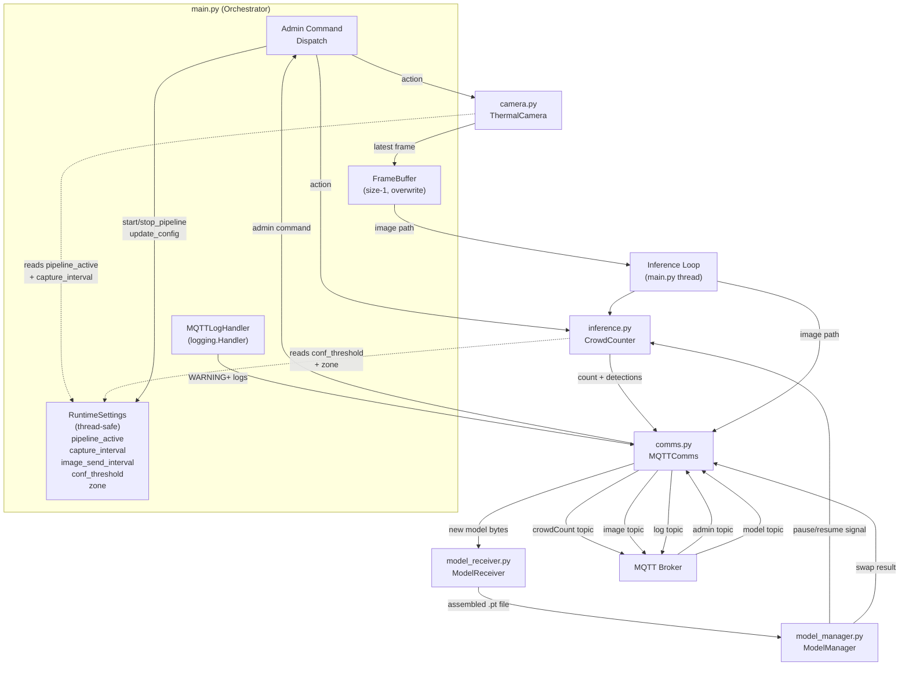
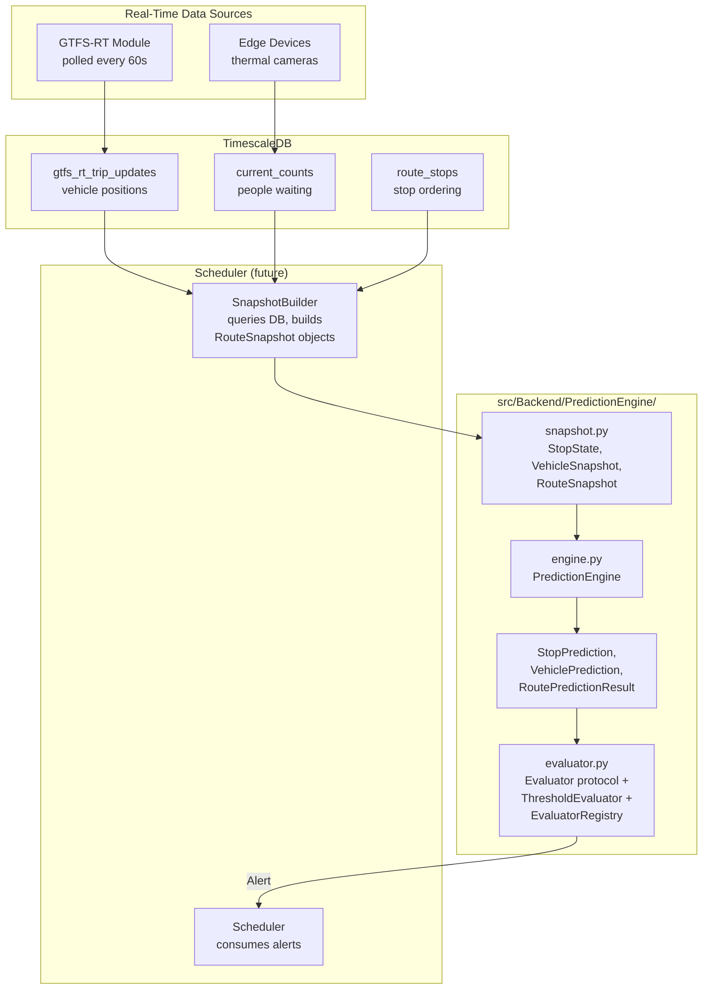

# TransitFlow System Architecture

## Architecture Overview

```mermaid
flowchart LR
    subgraph edgeDevice ["Edge Device (src/Edge)"]
        Main["main.py\n(orchestrator)"]
        Comms["comms.py\nMQTTComms"]
        Inference["inference.py\nCrowdCounter"]
        Camera["camera.py\nThermalCamera + FrameBuffer"]
        ModelMgr["model_manager.py"]
        ModelRecv["model_receiver.py"]
        OfflineQueue["paho internal queue"]
    end

    subgraph broker ["Docker (eclipse-mosquitto:2)"]
        Mosquitto["Mosquitto Broker\n:8883 MQTTS"]
    end

    subgraph backend ["Backend (src/Backend/MQTTBroker)"]
        BrokerHandler["broker_handler.py"]
        ModelDistributor["model_distributor.py"]
    end

    subgraph gtfsrt ["GTFS-RT (src/Backend/GTFS_RT)"]
        Fetcher["fetcher.py\nGTFSRealtimeFetcher"]
    end

    subgraph db ["Docker (TimescaleDB)"]
        TimescaleDB["TimescaleDB\n:5432"]
    end

    subgraph prediction ["PredictionEngine (src/Backend/PredictionEngine)"]
        Engine["engine.py\nPredictionEngine"]
        Evaluator["evaluator.py\nThresholdEvaluator"]
    end

    subgraph simulator ["Crowd Simulator (src/Simulator)"]
        SimOrch["orchestrator.py"]
        SimGen["generator.py\nStopSimulator"]
    end

    subgraph api ["Backend API (src/Backend/API)"]
        FastAPI["main.py\nFastAPI + WebSocket"]
        Queries["queries.py"]
    end

    subgraph dashboard ["Dashboard (src/Frontend/dashboard)"]
        React["React + Vite\n:5173"]
    end

    SimOrch -->|"edge/{id}/crowdCount  QoS1"| Mosquitto
    SimOrch -->|"edge/{id}/status  QoS1"| Mosquitto

    Comms -->|"edge/{id}/crowdCount  QoS1"| Mosquitto
    Comms -->|"edge/{id}/image  QoS2"| Mosquitto
    Comms -->|"edge/{id}/log  QoS1"| Mosquitto
    ModelRecv -->|"edge/{id}/model  0x03 ack  QoS2"| Mosquitto

    Mosquitto -->|"edge/{id}/admin  QoS2"| Comms
    Mosquitto -->|"edge/{id}/model  0x01+0x02  QoS2"| ModelRecv

    Mosquitto -->|"edge/+/crowdCount"| BrokerHandler
    Mosquitto -->|"edge/+/image"| BrokerHandler
    Mosquitto -->|"edge/+/log"| BrokerHandler
    Mosquitto -->|"edge/+/model  0x03 ack"| BrokerHandler

    BrokerHandler -->|"edge/{id}/admin"| Mosquitto
    ModelDistributor -->|"edge/{id}/model  0x01+0x02"| Mosquitto

    Camera -->|"frame path"| Main
    Main -->|"image"| Inference
    Inference -->|"count result"| Comms
    ModelRecv -->|"on_model_ready"| ModelMgr
    ModelMgr -->|"pause/resume/reload"| Inference
    Comms --- OfflineQueue

    BrokerHandler -->|"crowd counts,\nlogs, status"| TimescaleDB
    Fetcher -->|"NTA API\npolled every 60s"| TimescaleDB
    TimescaleDB -->|"RouteSnapshot"| Engine
    Engine -->|"RoutePredictionResult"| Evaluator
    Evaluator -->|"Alert"| TimescaleDB
    TimescaleDB --> Queries
    Queries --> FastAPI
    FastAPI -->|"WebSocket /ws/dashboard"| React
```




## Connection and Security Policy

- **MQTT protocol version**: MQTT v5 (paho-mqtt v2.0 default). Uses `clean_start=False` with `session_expiry_interval=0xFFFFFFFF` (max / never expire) for persistent sessions. MQTT v5 also gives us better error reporting via reason codes and the `no_local` subscription option (useful on the shared `model` topic to avoid receiving self-published messages)

- **TLS encryption**: All connections use MQTTS (port 8883). A self-signed CA is generated for dev; production should use real certs. Both edge and backend clients call `tls_set(ca_certs, certfile, keyfile)`

- **Client ID**: Every client MUST use a stable, unique `client_id` (e.g., `edge-{device_id}` for edge, `backend-handler` for backend). Required for persistent sessions to work -- the broker uses `client_id` to match reconnecting clients to their stored session. Note: only one backend MQTT client exists (`backend-handler`); `ModelDistributor` shares it

- **Per-topic QoS**:
  - **QoS 1** (at least once): `edge/{id}/crowdCount`, `edge/{id}/log` -- high-frequency, tolerates occasional duplicates
  - **QoS 2** (exactly once): `edge/{id}/image`, `edge/{id}/admin`, `edge/{id}/model`. Ensures admin commands execute once and model chunks arrive without duplication

- **Persistent sessions**: `clean_start=False` on all clients. The broker stores subscriptions and queues QoS 1/2 messages for disconnected clients (up to Mosquitto's `max_queued_messages` limit)

- **Always-on connection**: Both edge and backend clients use `loop_start()` (background thread) with automatic reconnect and exponential backoff

- **Offline message queuing**: Handled by **paho-mqtt's built-in queue** -- when disconnected, QoS 1/2 `publish()` calls are queued internally and sent on reconnect. No custom queue needed. Configure with:
  - `max_queued_messages_set(0)` -- unlimited queue (or set a cap for memory-constrained edge devices)
  - `max_inflight_messages_set(100)` -- increase from default 20, especially important for model chunk throughput

- **Thread safety**: paho-mqtt callbacks run in the network loop thread. `ModelReceiver` chunk buffers and `BrokerHandler` data handlers use `threading.Lock` for shared state. On the edge device, `RuntimeSettings` uses `threading.Lock` for all property access, `FrameBuffer` uses `threading.Condition` for the producer-consumer handoff between the camera and inference threads, and `CrowdCounter` uses `threading.Event` for pause/resume during model swaps


## Topic Hierarchy

Combined with `clean_start=False`, the broker stores undelivered messages for disconnected clients.

Five topics per device (plus one LWT status topic):

- **Edge -> Backend**: `edge/{device_id}/crowdCount` -- JSON crowd count data -- **QoS 1**

- **Edge -> Backend**: `edge/{device_id}/image` -- Binary image with metadata header -- **QoS 2**

- **Edge -> Backend**: `edge/{device_id}/log` -- JSON log entries (errors, warnings, info) -- **QoS 1**

- **Backend -> Edge**: `edge/{device_id}/admin` -- JSON admin info/commands -- **QoS 2**

- **Bidirectional**: `edge/{device_id}/model` -- Unified model transfer topic -- **QoS 2**. All messages carry a 1-byte type prefix:
  - `0x01` = **meta** (backend -> edge): JSON with filename, total_chunks, total_size, sha256, chunk_size
  - `0x02` = **chunk** (backend -> edge): binary chunk_index + chunk_sha256 + chunk_data
  - `0x03` = **ack** (edge -> backend): JSON with status, sha256_verified, or missing_chunks on error

- **Broker-managed**: `edge/{device_id}/status` -- LWT topic. Edge sets will message `{"online": false}` on connect; broker publishes it automatically on ungraceful disconnect. Edge publishes `{"online": true}` on successful connect. Backend subscribes to `edge/+/status` to track device presence -- **QoS 1**


## 1. Docker / Mosquitto Setup

**New files:**

- [docker/mosquitto/mosquitto.conf](docker/mosquitto/mosquitto.conf) -- Mosquitto config:
  - TLS listener on port **8883** (no plaintext 1883)
  - `cafile`, `certfile`, `keyfile` paths pointing to mounted certs
  - `persistence true` with `persistence_location /mosquitto/data/`
  - `max_queued_messages 0` (unlimited queuing for persistent sessions with offline devices)
  - `max_message_size 10485760` (10MB -- sufficient for thermal images; model chunks are 256KB each)
  - `allow_anonymous true` (for dev; switch to password auth for production)

- [docker/mosquitto/acl](docker/mosquitto/acl) -- Access control list (placeholder for future auth)

- [docker/mosquitto/certs/generate_certs.sh](docker/mosquitto/certs/generate_certs.sh) -- Shell script that generates a self-signed CA + server cert + client cert using OpenSSL for dev/testing. Outputs `ca.crt`, `server.crt`, `server.key`, `client.crt`, `client.key`

- [docker/docker-compose.yml](docker/docker-compose.yml) -- Single service `mosquitto` using `eclipse-mosquitto:2` image, mapping port **8883** (MQTTS), mounting config + certs + data volumes


## 2. Edge Device Module (`src/Edge/`)

The edge device runs a continuous capture-inference pipeline. On startup it connects to the broker, opens the thermal camera, and loops: capture frame -> run YOLO inference -> publish crowd count. All settings are remotely configurable via admin commands, and the pipeline can be stopped/started without disconnecting from MQTT.


### Edge Architecture




### Runtime Behaviour

On startup the edge device:

1. Loads static config + initialises mutable `RuntimeSettings` (pipeline starts **active** by default)
2. Connects to the MQTT broker and stays connected (auto-reconnect on drop)
3. Starts the continuous **capture-inference loop** in a background thread at the configured interval
4. Every tick: camera grabs a frame -> inference runs -> crowd count is published; image is also sent at its own (slower) interval
5. The device keeps running this loop indefinitely until a shutdown signal

**Remote start/stop** -- the backend can send `{"action": "stop_pipeline"}` to halt capture and inference, and `{"action": "start_pipeline"}` to resume. When stopped, the camera loop thread stays alive but skips capture+inference each tick (no thread destruction/creation). The MQTT connection, admin command listening, and model receiving all remain active while the pipeline is stopped -- only the camera+inference work pauses.

**Remote configurability** -- the backend can send `{"action": "update_config", "settings": {...}}` to change runtime settings on the fly. The edge applies them immediately (next loop tick). Configurable settings include capture interval, image send interval, inference confidence threshold, zone label, and the pipeline active flag. This is handled by a thread-safe `RuntimeSettings` object that all modules read from.

**Two-thread pipeline** -- Camera captures at `capture_interval` into the `FrameBuffer`, inference reads the latest frame from the buffer and processes it. If inference is slower than capture, stale frames are overwritten so inference always works on the most current image. Admin commands available:

- `{"action": "stop_pipeline"}` -- halts capture+inference (MQTT stays connected, model receiving still works)
- `{"action": "start_pipeline"}` -- resumes capture+inference
- `{"action": "update_config", "settings": {"capture_interval": 5}}` -- changes settings live (takes effect next tick)

Any module that calls `logger.warning(...)` or `logger.error(...)` automatically gets that message sent to the backend -- no explicit comms calls needed.


### Design Decisions

Approved and included in this architecture:

- **MQTT log handler**: A `MQTTLogHandler(logging.Handler)` is attached to the root logger at WARNING level. Any module that calls `logger.warning(...)` or `logger.error(...)` automatically sends that message to the backend via `comms.send_log()` -- no explicit comms calls needed
- **Size-1 frame buffer with overwrite**: Camera and inference run in separate threads, connected by a `FrameBuffer`. The camera always overwrites the buffer with the latest frame. If inference is slower than capture, stale frames are discarded -- inference always processes the most current image
- **Model swap rollback**: If a newly received model fails to load in YOLO, the model manager automatically restores the backup model and resumes inference, rather than leaving the system broken

Core patterns:

- **Event-based sleep** in the camera loop for interruptible waits and clean shutdown
- **RuntimeSettings** as the single thread-safe source of truth for all mutable parameters
- **Callback-based wiring** -- modules communicate via callbacks registered in `main.py`; no cross-imports
- **threading.Event pause/resume** in `CrowdCounter` for model swap safety


### Files

**Files:**

- [src/Edge/requirements.txt](src/Edge/requirements.txt) -- All dependencies: `paho-mqtt>=2.0`, `ultralytics==8.3.228`, `torch==2.9.1`, `torchvision==0.24.1`, `opencv-python==4.12.0.88`, `numpy==2.2.6`, `Pillow==12.0.0`

- [src/Edge/config.py](src/Edge/config.py) -- Static configuration (broker host/port, device_id, TLS cert paths, topic prefixes, QoS levels, model directory paths, camera device index) plus the `RuntimeSettings` class:
  - `RuntimeSettings` -- Thread-safe mutable settings object. Properties: `pipeline_active`, `capture_interval`, `image_send_interval`, `conf_threshold`, `zone`. All reads/writes protected by `threading.Lock`. Has an atomic `update(changes: dict)` method for bulk admin updates that returns only what actually changed

- [src/Edge/comms.py](src/Edge/comms.py) -- `MQTTComms` class (renamed from the original `EdgeClient`; backward-compat alias `EdgeClient = MQTTComms` is preserved):
  - Constructor: creates `mqtt.Client(client_id="edge-{device_id}", protocol=MQTTv5)`, connects with `clean_start=False` and `properties.SessionExpiryInterval=0xFFFFFFFF`, calls `tls_set()`, `max_queued_messages_set(0)`, `max_inflight_messages_set(100)`, sets LWT to `edge/{id}/status` with payload `{"online": false}` (QoS 1, retain=True)
  - `connect()` -- connects to broker, `on_connect` callback publishes `{"online": true}` to `edge/{id}/status` (retain=True) and subscribes to `edge/{id}/admin` and `edge/{id}/model`
  - **Offline resilience**: paho-mqtt's internal queue handles buffering of QoS 1/2 publishes while disconnected. No custom queue needed -- just call `publish()` normally and paho queues if offline
  - `send_crowd_count(data: dict)` -- serializes dict to JSON, publishes to `edge/{id}/crowdCount` (**QoS 1**)
  - `send_image(image_path: str, metadata: dict)` -- reads image file as raw bytes, prepends a JSON header (timestamp, filename, metadata length) separated by a length prefix, publishes to `edge/{id}/image` (**QoS 2**)
  - `send_log(level: str, message: str, extra: dict = None)` -- publishes JSON log entry to `edge/{id}/log` (**QoS 1**). Payload: `{"level": "error"|"warning"|"info", "message": "...", "timestamp": "...", "extra": {...}}`
  - `set_admin_callback(callback)` -- registers a function called when a message arrives on `edge/{id}/admin`
  - `set_model_receiver(model_receiver)` -- attaches a `ModelReceiver` for handling incoming model messages. Subscribes to `edge/{id}/model` with `no_local=True` (MQTT v5), dispatches `0x01` (meta) and `0x02` (chunk) to the receiver
  - `MQTTLogHandler` -- Custom `logging.Handler` that intercepts WARNING+ log records and forwards them to the backend via `comms.send_log()`. Includes a reentrant guard (`_reentrant` flag) to prevent infinite recursion if `send_log()` itself triggers a warning

- [src/Edge/inference.py](src/Edge/inference.py) -- `CrowdCounter` class (ported from `InferProto`):
  - Constructor: loads a YOLO model from disk, selects CUDA or CPU device, initialises a `threading.Event` for pause/resume control
  - `count(image_path)` -- blocks if paused (during model swap), runs `model.predict()` using `settings.conf_threshold` and `settings.zone` read live from `RuntimeSettings`, returns structured dict `{device_id, timestamp, count, zone}`
  - `pause()` / `resume()` -- clears/sets the internal event, causing `count()` to block/unblock. Used by `ModelManager` during model swaps
  - `reload_model(model_path)` -- loads a new YOLO model from disk. Raises on failure (used by `ModelManager` to trigger rollback)

- [src/Edge/camera.py](src/Edge/camera.py) -- `ThermalCamera` and `FrameBuffer`:
  - `FrameBuffer` -- Size-1 overwrite buffer using `threading.Condition`. The camera thread calls `put(path)` (overwrites any unconsumed frame), the inference thread calls `get(timeout)` (blocks until available, returns `None` on timeout). Ensures inference always processes the latest frame
  - `ThermalCamera` -- Opens an OpenCV `VideoCapture` device and runs a background thread that reads `settings.pipeline_active` and `settings.capture_interval` every tick. When active: captures a frame, saves to a temp file, puts the path in `FrameBuffer`. When inactive: idles (0.5s poll). `start()` / `stop()` manage the thread lifecycle

- [src/Edge/model_manager.py](src/Edge/model_manager.py) -- `ModelManager` class:
  - Constructed with paths to `current_dir` and `backup_dir`, a `model_filename`, a `CrowdCounter` reference, and a `notify_fn` callback for backend logging
  - `install_new_model(new_model_path)` -- (1) pauses inference, (2) copies current model to backup, (3) moves new model to current, (4) attempts `crowd_counter.reload_model()`, (5) on success: resumes and notifies, (6) on failure: calls `rollback()` (restores backup to current, reloads), then resumes. Inference is always resumed in a `finally` block
  - `rollback()` -- copies backup model to current directory and reloads. Handles missing backup gracefully

- [src/Edge/model_receiver.py](src/Edge/model_receiver.py) -- `ModelReceiver` class. Constructed with a `publish_fn` callback (bound to `MQTTComms.publish_raw`) so it can send ACKs without owning the client:
  - On receiving type `0x01` (meta): stores expected chunk count, total size, SHA256 hash, creates a temp directory on disk for chunk storage
  - On receiving type `0x02` (chunk): payload after type byte = `4-byte chunk_index + 32-byte SHA256_chunk_hash + chunk_data`. Verifies chunk hash, writes chunk to disk (one file per chunk in temp dir)
  - When all chunks received: reads chunks from disk in order, reassembles into a temp file, verifies full-file SHA256 against metadata hash
  - On success: publishes ACK (type `0x03` prefix + JSON) with status "success", then calls `on_model_ready(assembled_path)` callback (wired to `ModelManager.install_new_model`)
  - On failure: publishes ACK with status "error" + missing/corrupt chunk indices
  - Thread-safe: uses `threading.Lock` around chunk state since callbacks run on paho's network thread

- [src/Edge/main.py](src/Edge/main.py) -- Entry point / orchestrator. Wires all modules together and runs the pipeline:
  1. Creates `RuntimeSettings` and `shutdown_event`
  2. Initialises `MQTTComms`, connects, starts loop
  3. Attaches `MQTTLogHandler` to root logger (WARNING+ auto-forwarded to backend)
  4. Creates `CrowdCounter` with the current model path
  5. Creates `FrameBuffer` and `ThermalCamera`
  6. Creates `ModelReceiver` and `ModelManager`, wires `on_model_ready` callback
  7. Defines `handle_admin()` dispatch: `update_config`, `stop_pipeline`, `start_pipeline`, `restart`, `status` (last two are placeholders)
  8. Runs inference loop in a background thread: reads from `FrameBuffer`, calls `counter.count()`, publishes crowd count, periodically sends images based on `image_send_interval`
  9. Starts camera and inference threads
  10. Blocks on `shutdown_event` (set by SIGINT/SIGTERM)
  11. Cleanup: stops camera, joins inference thread, disconnects MQTT


## 3. Backend MQTT Handler (`src/Backend/MQTTBroker/`)

**New files:**

- [src/Backend/MQTTBroker/requirements.txt](src/Backend/MQTTBroker/requirements.txt) -- `paho-mqtt>=2.0`

- [src/Backend/MQTTBroker/config.py](src/Backend/MQTTBroker/config.py) -- Backend configuration: broker host/port (8883), TLS cert paths, subscribed topics, model storage path, chunk size = 256KB default

- [src/Backend/MQTTBroker/broker_handler.py](src/Backend/MQTTBroker/broker_handler.py) -- `BrokerHandler` class. Owns a single shared `mqtt.Client(client_id="backend-handler", protocol=MQTTv5)`, connects with `clean_start=False` and `SessionExpiryInterval=0xFFFFFFFF`:
  - Subscribes to `edge/+/crowdCount` -- logs/processes JSON payloads
  - Subscribes to `edge/+/image` -- extracts header + binary image, saves to disk with device_id + timestamp naming
  - Subscribes to `edge/+/log` -- receives and logs device error/warning/info entries
  - Subscribes to `edge/+/status` -- tracks device online/offline presence via LWT retained messages
  - Subscribes to `edge/+/model` with `no_local=True` (MQTT v5) -- broker won't echo back self-published meta/chunks, so only `0x03` (ack) messages from edge devices arrive. Forwards ACKs to `ModelDistributor` via callback/event
  - `send_admin(device_id: str, command: dict)` -- publishes JSON command to `edge/{device_id}/admin` (**QoS 2**)
  - Exposes the MQTT client to `ModelDistributor` so it can publish on the same connection (avoids a second persistent session)

- [src/Backend/MQTTBroker/model_distributor.py](src/Backend/MQTTBroker/model_distributor.py) -- `ModelDistributor` class. Uses `BrokerHandler`'s MQTT client for publishing; receives ACK events via a `threading.Event` / callback registered with `BrokerHandler`:
  - `distribute_model(device_id: str, model_path: str)`:
    1. Computes SHA256 of the entire `.pt` file
    2. Splits file into chunks (default 256KB each)
    3. Publishes metadata to `edge/{device_id}/model` with type prefix `0x01` + JSON payload at **QoS 2**
    4. Iterates chunks, publishing each to `edge/{device_id}/model` with type prefix `0x02` + `chunk_index (4 bytes, big-endian) + chunk_sha256 (32 bytes) + chunk_data` at **QoS 2** -- exactly-once delivery prevents duplicate chunks; SHA256 hashes provide additional integrity verification
    5. Adds a configurable delay between chunks to avoid overwhelming the broker/network
    6. Blocks waiting for ACK (type `0x03`) via `threading.Event` set by `BrokerHandler`'s model callback; retries failed/missing chunks if needed; times out after configurable duration

- [src/Backend/MQTTBroker/main.py](src/Backend/MQTTBroker/main.py) -- Entry point. Instantiates `BrokerHandler` and `ModelDistributor`. Provides a simple CLI interface to:
  - View connected devices (via LWT/status tracking)
  - Send admin commands to a device
  - Distribute a `.pt` model to a device


## 4. Image Transfer Protocol

Since MQTT supports binary payloads natively, images are sent as a single message with a structured payload:

```
[4 bytes: header_length (big-endian)] [JSON header bytes] [raw image bytes]
```

The JSON header contains: `device_id`, `timestamp`, `filename`, and any custom `metadata`. No image-specific fields (dimensions, format detection) -- the file extension is inferred from the filename. The backend parses the header length, extracts the JSON header, then saves the remaining bytes as the image file.


## 5. Chunked Model Transfer Protocol

For large `.pt` files (often 50-500MB+), we use a custom chunking protocol over the single `edge/{id}/model` topic (QoS 2). Every message starts with a **1-byte type prefix**:

1. **Type `0x01` -- Meta** (backend -> edge):
  Payload: `[0x01][JSON bytes]`

```json
   {
     "filename": "yolov8_thermal.pt",
     "total_chunks": 2048,
     "total_size": 536870912,
     "sha256": "abc123...",
     "chunk_size": 262144
   }
```

2. **Type `0x02` -- Chunk** (backend -> edge):
  Payload: `[0x02][4B chunk_index][32B chunk_sha256][chunk_data]`

3. **Type `0x03` -- ACK** (edge -> backend):
  Payload: `[0x03][JSON bytes]`

```json
   {
     "filename": "yolov8_thermal.pt",
     "status": "success",
     "sha256_verified": true
   }
```

   Or on failure:

```json
   {
     "status": "error",
     "missing_chunks": [12, 45, 99],
     "message": "SHA256 mismatch"
   }
```

Both sides subscribe to `edge/{id}/model` with `no_local=True` (MQTT v5), so self-published messages are never echoed back. The backend only receives `0x03` (ack) from edge devices, and the edge only receives `0x01`/`0x02` from the backend. The backend retries any missing/corrupted chunks reported in the error ACK.


## 6. GTFS-RT Fetcher (`src/Backend/GTFS_RT/`)

Polls the NTA (National Transport Authority) GTFS-Realtime TripUpdates API every 60 seconds and writes parsed rows into the `gtfs_rt_trip_updates` hypertable. This provides the system with real-time vehicle positions and delay information for Dublin Bus routes.

The NTA feed provides protobuf-encoded `FeedMessage` responses containing `TripUpdate` entities. Each entity includes a `TripDescriptor` (trip_id, route_id, direction_id) and one or more `StopTimeUpdate` entries (stop_sequence, arrival_delay, departure_delay). The first `StopTimeUpdate` in each entity reveals the vehicle's current position -- e.g., if the first listed stop has `stop_sequence=21`, the vehicle has already passed stops 1-20.

**Key data realities:**
- `vehicle_id` is often missing (~50% of entities lack it). `trip_id` is the reliable identifier
- `direction_id` (0 or 1) is extracted from the protobuf `TripDescriptor` to distinguish inbound vs outbound trips
- "ADDED" trips sometimes have empty `trip_id` values
- No passenger counts or vehicle capacity data is available from the feed

**Files:**

- [src/Backend/GTFS_RT/config.py](src/Backend/GTFS_RT/config.py) -- Configuration via environment variables: `GTFSR_API_URL`, `GTFSR_API_KEY`, `GTFSR_FORMAT` (protobuf or JSON), `GTFSR_POLL_INTERVAL` (minimum 60s per NTA fair-usage policy), `GTFSR_AGENCY_FILTER` (default: Dublin Bus agency ID), `GTFSR_RETAIN_FETCHES` (number of recent fetches to keep)

- [src/Backend/GTFS_RT/fetcher.py](src/Backend/GTFS_RT/fetcher.py) -- `GTFSRealtimeFetcher` class:
  - `fetch_feed()` -- HTTP GET with rate-limit guard (enforces 60s minimum between requests). Returns a parsed protobuf `FeedMessage` or `None` on failure
  - `parse_trip_updates(feed, route_ids)` -- Extracts `TripUpdate` entities into flat dicts for DB insertion. Each `StopTimeUpdate` within a `TripUpdate` produces one dict (one row in `gtfs_rt_trip_updates`). Extracts `direction_id` from `TripDescriptor` via `trip.HasField("direction_id")`. Optionally filters by `route_ids` set

- [src/Backend/GTFS_RT/main.py](src/Backend/GTFS_RT/main.py) -- Entry point. Connects to the database, loads route filter from the `routes` table, and runs a continuous poll loop (or a single `--once` fetch cycle for testing). Handles SIGINT/SIGTERM for graceful shutdown. Includes consecutive-failure tracking to throttle log spam during extended outages


## 7. Crowd Count Simulator (`src/Simulator/`)

Standalone module that replaces edge devices for demo purposes. Publishes realistic `crowdCount` MQTT messages for 587 stops across 12 Dublin Bus routes (39A, 37, 13, 15, 16, 27, 39, 44, 1, 4, 7, 11), using the same topics and payload format as real edge devices. The system cannot distinguish simulator data from real edge data.

**Key behaviours:**
- **Biased random walk**: Each stop's count drifts toward a demand-driven target using Gaussian noise, producing temporally coherent data (no unrealistic jumps)
- **Time-of-day demand profiles**: Interpolated curve with AM/PM rush peaks (7:30-9:30, 16:30-18:30) and late-night troughs
- **Stop position weighting**: Mid-route stops (city centre) have higher base counts than termini (bell curve)
- **Multi-route multiplier**: Stops serving multiple routes get proportionally higher counts
- **Vehicle arrival dips**: Random simulated dips when a vehicle "arrives" at a stop
- **Staggered updates**: Each stop publishes every 15-20s, offsets staggered across all 587 stops to avoid MQTT bursts
- **Startup backfill**: Seeds initial counts for all stops in ~30s before entering the main loop
- **Configurable time scale**: `SIM_TIME_SCALE` env var compresses a full day (e.g., `10` = full day in ~2.4h)

**Files:**

- [src/Simulator/config.py](src/Simulator/config.py) -- MQTT broker settings, timing constants, 12 hardcoded Dublin Bus route definitions with GTFS stop sequences (`ROUTES` dict)
- [src/Simulator/profiles.py](src/Simulator/profiles.py) -- `time_of_day_multiplier()`, `position_weight()`, `build_route_multipliers()`, `base_cap_for_stop()`
- [src/Simulator/generator.py](src/Simulator/generator.py) -- `StopSimulator` class: biased random walk with vehicle dips and hard caps
- [src/Simulator/orchestrator.py](src/Simulator/orchestrator.py) -- `Orchestrator` class: builds and manages all `StopSimulator` instances, handles backfill, staggered scheduling, and periodic stats logging
- [src/Simulator/main.py](src/Simulator/main.py) -- Entry point: MQTT client with TLS, online/offline status publishing, backfill then main loop. `client_id="crowd-simulator"`


## 8. FastAPI Dashboard API (`src/Backend/API/`)

Serves the real-time dashboard via WebSocket. Queries all database tables and assembles a unified JSON payload broadcast to connected clients whenever new data arrives (triggered by PostgreSQL `NOTIFY`).

**Key features:**
- WebSocket endpoint at `/ws/dashboard` with per-client coalescing to avoid overwhelming slow clients
- Builds the full payload via `build_dashboard_payload()` which queries routes, stops, crowd counts, vehicles, crowding hotspots, route health (from GTFS-RT delays), on-time performance, fleet utilisation, resource efficiency, and alerts
- CORS middleware for local development

**Files:**

- [src/Backend/API/main.py](src/Backend/API/main.py) -- FastAPI app, WebSocket handler, DB listener thread
- [src/Backend/API/queries.py](src/Backend/API/queries.py) -- All SQL queries and payload assembly
- [src/Backend/API/ws.py](src/Backend/API/ws.py) -- WebSocket connection manager


## 9. React Dashboard (`src/Frontend/dashboard/`)

Vite-powered React application displaying live transit data. Connects to the FastAPI WebSocket and renders crowd counts, route health, on-time performance, fleet utilisation, and alerts. Supports filtering by transport type (all/bus/luas).


## 10. Demo Scripts (`scripts/`)

Comprehensive startup and shutdown scripts for running the full system locally on Windows (Git Bash).

- [scripts/start_demo.sh](scripts/start_demo.sh) -- Starts all services in order: Docker containers, database seed (idempotent), GTFS-RT fetcher (conditional on API key), BrokerHandler, FastAPI, React dashboard, crowd simulator. Includes health checks, port verification, process cleanup, and a firewall safety audit. All service logs go to `logs/`
- [scripts/stop_demo.sh](scripts/stop_demo.sh) -- Stops all services: kills by port and by Python module name (via PowerShell for reliability on Windows), optionally leaves Docker running (`--keep-docker`)


## 11. PredictionEngine (`src/Backend/PredictionEngine/`)

Pure-computation module that simulates vehicle journeys along routes to estimate passenger load and identify overcrowding. Has no direct dependency on MQTT, GTFS-RT, or the database layer -- it operates entirely on frozen dataclass snapshots, making it fully testable and reusable.

A separate SnapshotBuilder (future) will query the database and construct the `RouteSnapshot` objects that feed the engine.


### PredictionEngine Architecture




### Data Models (snapshot.py)

Immutable frozen dataclasses representing a point-in-time view:

**Input snapshots:**
- `StopState` -- one stop along a route: `stop_id`, `sequence`, `people_waiting` (None if no edge device)
- `VehicleSnapshot` -- one active vehicle: `vehicle_id` (trip_id from GTFS-RT), `route_id`, `capacity`, `current_stop_sequence`, `passenger_count` (defaults to 0)
- `RouteSnapshot` -- complete snapshot for one route + direction: ordered `stops` tuple and `vehicles` tuple

**Prediction output:**
- `StopPrediction` -- predicted state at one stop for one vehicle: `predicted_passengers` (estimated load after boarding), `boarded`, `alighted`, `has_data`
- `VehiclePrediction` -- aggregated prediction for one vehicle: all stop predictions, `peak_load`, `peak_occupancy_pct`, `confidence` (fraction of stops with edge device data)
- `RoutePredictionResult` -- full output for one route + direction: all vehicle predictions and `stranded_at_stops` (people left behind)


### Sequential Simulation Algorithm (engine.py)

`PredictionEngine.predict_route(snapshot, alighting_fraction)` processes vehicles from front to back along the route over a shared mutable array of waiting passengers:

1. Build a `remaining[]` array from each stop's `people_waiting` (None treated as 0)
2. Sort vehicles by `current_stop_sequence` descending (furthest ahead first), tiebreak by `vehicle_id` ascending
3. For each vehicle, walk from its current stop to the second-to-last stop (terminus excluded):
   - **Alight**: `round(load * alighting_fraction)` passengers get off (clamped to load)
   - **Board**: `min(remaining[i], max(0, capacity - load))` passengers get on
   - Reduce `remaining[i]` by the number who boarded (vehicles behind see reduced counts)
4. After all vehicles: `stranded_at_stops` = stops where `remaining[i] > 0`

The alighting-before-boarding model matches real bus operations: passengers exit first (freeing capacity), then new passengers board. The default `alighting_fraction` of 0.05 (5%) produces 1-3 passengers alighting per stop for typical Dublin Bus loads (40-80 passengers).


### Pluggable Evaluation (evaluator.py)

Three-layer architecture for per-route scheduling decisions:

1. **`Evaluator` protocol** -- any object with `evaluate(result: RoutePredictionResult) -> Alert | None`
2. **`ThresholdEvaluator`** -- concrete evaluator with dual triggers:
   - `occupancy_threshold` (default 0.9): alert if any vehicle's peak load exceeds this fraction of capacity
   - `min_stranded` (default 5): alert if total stranded passengers exceed this count
   - `min_confidence` (default 0.3): vehicles with confidence below this are excluded from the occupancy check (too little data). The stranded check is not gated by confidence because stranded counts are inherently conservative
3. **`EvaluatorRegistry`** -- maps `route_id` to an `Evaluator` instance with a default fallback. Different routes can use different evaluators or differently-configured thresholds

`Alert` dataclass captures the worst-case vehicle, trigger stop, occupancy, stranded count, and evaluator-specific `trigger_detail` dict.


### Files

- [src/Backend/PredictionEngine/\_\_init\_\_.py](src/Backend/PredictionEngine/__init__.py) -- Public exports for all models, engine, and evaluator classes

- [src/Backend/PredictionEngine/snapshot.py](src/Backend/PredictionEngine/snapshot.py) -- Immutable dataclasses: `StopState`, `VehicleSnapshot`, `RouteSnapshot`, `StopPrediction`, `VehiclePrediction`, `RoutePredictionResult`

- [src/Backend/PredictionEngine/engine.py](src/Backend/PredictionEngine/engine.py) -- `PredictionConfig` dataclass and `PredictionEngine` class with `predict_route()` implementing the sequential simulation

- [src/Backend/PredictionEngine/evaluator.py](src/Backend/PredictionEngine/evaluator.py) -- `Alert` dataclass, `Evaluator` protocol, `ThresholdEvaluator` (dual trigger with confidence gating), `EvaluatorRegistry` (per-route dispatch)


## Getting Started

### 1. Generate TLS Certificates

```bash
cd docker/mosquitto/certs
bash generate_certs.sh
```

### 2. Start the Mosquitto Broker

```bash
cd docker
docker-compose up -d
```

### 3. Install Python Dependencies

```bash
pip install -r src/Edge/requirements.txt
pip install -r src/Backend/MQTTBroker/requirements.txt
```

### 4. Run the Backend Handler

```bash
python -m src.Backend.MQTTBroker.main
```

The backend starts an interactive CLI with commands:
- `devices` -- list connected edge devices
- `admin <device_id> <json_command>` -- send admin command to a device
- `model <device_id> <file_path>` -- distribute a .pt model file to a device
- `help` -- show available commands
- `quit` -- shut down

### 5. Run an Edge Device

```bash
python -m src.Edge.main
```

The edge device connects to the broker, opens the thermal camera, and begins the continuous capture-inference pipeline. Crowd counts are published every `CAPTURE_INTERVAL` seconds (default 10). Images are forwarded to the backend every `IMAGE_SEND_INTERVAL` seconds (default 30). All runtime settings can be changed via admin commands without restarting the device.


### Configuration

Both modules are configured via environment variables or defaults in their `config.py` files:

**Connection & MQTT:**

| Variable | Default | Description |
|---|---|---|
| `MQTT_BROKER_HOST` | `localhost` | Broker hostname |
| `MQTT_BROKER_PORT` | `8883` | Broker TLS port |
| `EDGE_DEVICE_ID` | `edge-001` | Unique device identifier |
| `MQTT_CA_CERT` | `docker/mosquitto/certs/ca.crt` | CA certificate path |
| `MQTT_CLIENT_CERT` | `docker/mosquitto/certs/client.crt` | Client certificate path |
| `MQTT_CLIENT_KEY` | `docker/mosquitto/certs/client.key` | Client key path |

**Edge pipeline (static -- set at startup):**

| Variable | Default | Description |
|---|---|---|
| `CURRENT_MODEL_DIR` | `src/Edge/models/current` | Directory holding the active YOLO model |
| `BACKUP_MODEL_DIR` | `src/Edge/models/backup` | Directory holding the backup YOLO model |
| `MODEL_FILENAME` | `best.pt` | Name of the model file in current/backup dirs |
| `MODEL_SAVE_DIR` | `src/Edge/models` | Temp assembly path for model_receiver |
| `CAMERA_DEVICE_INDEX` | `0` | OpenCV VideoCapture device index or path |

**Edge pipeline (runtime -- changeable via admin commands):**

| Variable | Default | Description |
|---|---|---|
| `CAPTURE_INTERVAL` | `10` | Seconds between camera frame captures |
| `IMAGE_SEND_INTERVAL` | `30` | Seconds between sending images to backend |
| `CONF_THRESHOLD` | `0.25` | YOLO confidence threshold for detections |
| `ZONE` | `default` | Zone identifier included in crowd count data |

**Backend:**

| Variable | Default | Description |
|---|---|---|
| `RECEIVED_IMAGES_DIR` | `received/images` | Where backend saves received images |
| `RECEIVED_DATA_DIR` | `received/data` | Where backend saves received data |
| `MODEL_CHUNK_SIZE` | `262144` (256KB) | Chunk size for model distribution |
| `MODEL_ACK_TIMEOUT` | `300` | Seconds to wait for model ACK |
| `INTER_CHUNK_DELAY` | `0.01` | Seconds between chunk publishes |


## File Tree

```
TransitFlow/
  src/
    Edge/
      __init__.py
      requirements.txt
      config.py                 # Static config + RuntimeSettings
      comms.py                  # MQTTComms (MQTT client) + MQTTLogHandler
      inference.py              # CrowdCounter (YOLO inference)
      camera.py                 # ThermalCamera + FrameBuffer
      model_manager.py          # Model install / backup / rollback
      model_receiver.py         # Chunked model reassembly
      main.py                   # Orchestrator / entry point
      models/
        current/
          best.pt               # Active YOLO model
        backup/
          best.pt               # Backup YOLO model
    Backend/
      Database/
        __init__.py
        config.py
        connection.py
        writer.py
        seed.py
      MQTTBroker/
        __init__.py
        requirements.txt
        config.py
        broker_handler.py
        model_distributor.py
        main.py
      GTFS_RT/
        __init__.py
        __main__.py
        requirements.txt
        config.py
        fetcher.py               # NTA GTFS-Realtime TripUpdates parser
        main.py                  # Poll loop entry point
      API/
        __init__.py
        main.py                  # FastAPI app + WebSocket
        queries.py               # SQL queries + payload builder
        ws.py                    # WebSocket connection manager
      PredictionEngine/
        __init__.py
        snapshot.py              # Immutable data models
        snapshot_builder.py      # DB queries -> RouteSnapshot
        engine.py                # Sequential route simulation
        evaluator.py             # Pluggable condition evaluation
    Simulator/
      __init__.py
      __main__.py
      config.py                  # Routes, MQTT settings, timing
      profiles.py                # Demand curves, stop weighting
      generator.py               # StopSimulator (biased random walk)
      orchestrator.py            # Manages all stops, backfill, scheduling
      main.py                    # MQTT client entry point
    Frontend/
      dashboard/                 # React + Vite dashboard app
  scripts/
    start_demo.sh                # Start all services with health checks
    stop_demo.sh                 # Stop all services cleanly
  docker/
    docker-compose.yml
    mosquitto/
      mosquitto.conf
      acl
      certs/
        generate_certs.sh
```
