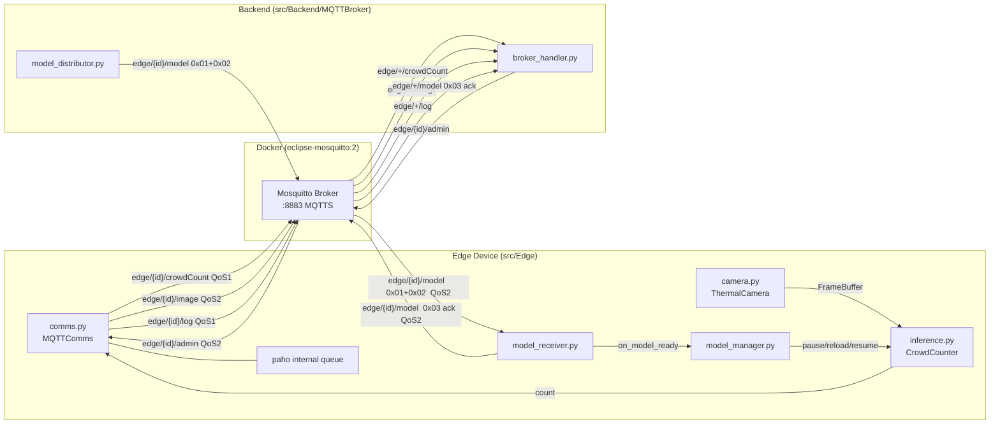
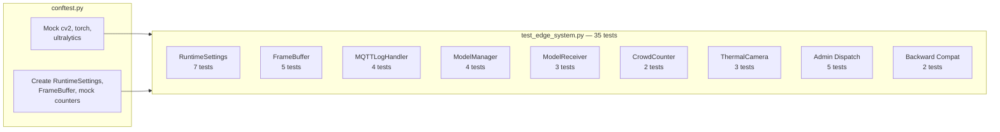
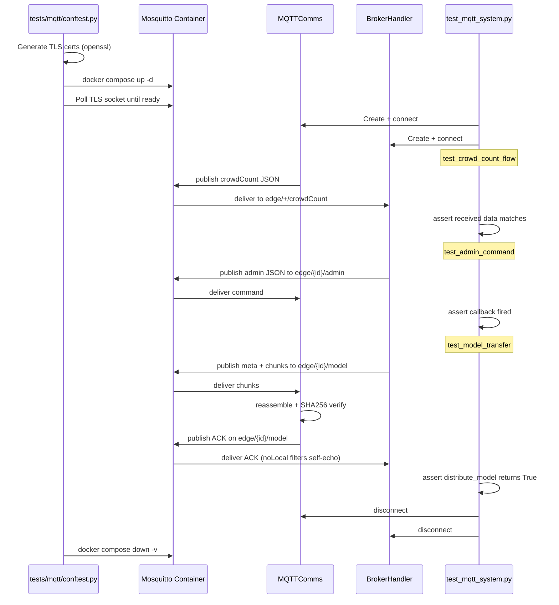

# TransitFlow Test Suite

## Overview

Five pytest-based test suites covering the TransitFlow system:

1. **Edge unit tests** (`tests/edge/`) -- 35 tests for all edge device modules (RuntimeSettings, FrameBuffer, MQTTLogHandler, ModelManager, ModelReceiver callback, CrowdCounter pause/resume, ThermalCamera pipeline control, admin dispatch, backward compatibility). Runs without Docker, YOLO, or a camera -- all external dependencies are mocked.

2. **Database unit tests** (`tests/database/`) -- 22 tests for the Database module (ConnectionPool, DatabaseWriter, BrokerHandler DB integration). All database interactions are mocked -- no Docker or running database required.

3. **Prediction unit tests** (`tests/prediction/`) -- 65 tests for the PredictionEngine module (sequential simulation algorithm, alighting model, edge cases, conservation invariants, evaluator thresholds, evaluator registry per-route dispatch, end-to-end flows). Pure Python -- no Docker, database, or external dependencies.

4. **Simulator unit tests** (`tests/simulator/`) -- 33 tests for the crowd count simulator (time-of-day demand profiles, interpolation smoothness, position weighting, multi-route multipliers, base capacity, StopSimulator random walk, temporal coherence, vehicle dips, Orchestrator stop building, deduplication, staggered scheduling, backfill). Pure Python -- no Docker, MQTT, or database required.

5. **MQTT integration tests** (`tests/mqtt/`) -- 11 end-to-end tests that automatically generate TLS certificates, start Mosquitto and TimescaleDB Docker containers, run tests for every MQTT message flow, then tear down Docker (including volumes) and clean up artifacts.

All test files are marked with `# *** TEST FILE - SAFE TO DELETE ***` headers.


## System Under Test




## Test Flow Architecture

### Edge Unit Tests (no Docker needed)



### Prediction Unit Tests (no Docker needed)

```mermaid
flowchart LR
    subgraph Setup ["conftest.py"]
        Helpers["make_stops, make_vehicle,\nmake_snapshot helpers"]
        EngFixture["engine fixture\n(PredictionEngine)"]
    end

    subgraph Tests ["test_prediction_engine.py — 65 tests"]
        SV["SingleVehicleBasic\n2 tests"]
        MV["MultiVehicle\n3 tests"]
        SP["StrandedPassengers\n1 test"]
        EC["EdgeCases\n11 tests"]
        AF["AlightingFraction\n2 tests"]
        RE["RouteEdgeCases\n2 tests"]
        PL["PeakLoadAndOccupancy\n1 test"]
        TE["ThresholdEvaluator\n8 tests"]
        ER["EvaluatorRegistry\n3 tests"]
        E2E["EndToEnd\n3 tests"]
        FC["FieldCorrectness\n6 tests"]
        RS["RealisticScenario\n2 tests"]
        AM["AlightingModel\n5 tests"]
        CI["ConservationInvariant\n4 tests"]
        NS["NonSequentialStops\n2 tests"]
        MC["MixedCapacities\n1 test"]
        TEA["ThresholdEvalAdditional\n5 tests"]
        NV["NoVehicles\n2 tests"]
        NC["NegativeCapacity\n1 test"]
    end

    Helpers --> Tests
    EngFixture --> Tests
```



### MQTT Integration Tests (requires Docker)




## Virtual Environment Setup

Create a Python venv at the project root to keep the global environment clean:

```bash
python -m venv .venv
.venv\Scripts\activate          # Windows
source .venv/bin/activate       # Linux / Mac
pip install paho-mqtt>=2.0 pytest psycopg2-binary>=2.9
```

A [requirements-dev.txt](requirements-dev.txt) lists test dependencies, separate from the per-module `requirements.txt` files:

```
paho-mqtt>=2.0
pytest>=9.0
psycopg2-binary>=2.9
```

**Note:** The edge unit tests (`tests/edge/`) mock `cv2`, `torch`, and `ultralytics` so they run with just `paho-mqtt` and `pytest`. The database unit tests mock `psycopg2` internals but require `psycopg2-binary` to be installed (it is imported at module level by `BrokerHandler`). No GPU, camera, or ML libraries needed for unit testing.


## Prerequisites

- **Python 3.13+**
- **Docker** (with Docker Compose v2)
- **OpenSSL** (for TLS cert generation)


## Files Created

### 1. `tests/edge/__init__.py`

Empty package marker with test-file header comment.


### 2. `tests/edge/conftest.py` -- Edge Unit Test Fixtures

Mocks heavy dependencies (`cv2`, `torch`, `ultralytics`) by injecting `MagicMock` objects into `sys.modules` before any Edge module is imported. This allows all tests to run without GPU, camera, or ML libraries.

**Fixtures:**

- `settings` -- Fresh `RuntimeSettings` instance with defaults
- `frame_buffer` -- Fresh `FrameBuffer` instance
- `mock_counter` -- `MockCrowdCounter` that records `count()` and `reload_model()` calls, supports pause/resume
- `failing_counter` -- `FailingCrowdCounter` that raises `RuntimeError` on `reload_model()` (simulates corrupt model)
- `mock_comms` -- `MockComms` that records `send_log()`, `send_crowd_count()`, `send_image()` calls
- `model_dirs` -- Creates temporary `current/` and `backup/` directories with dummy `.pt` files (via `tmp_path`)


### 3. `tests/edge/test_edge_system.py` -- 35 Edge Unit Tests

| Class | Count | What It Covers |
|---|---|---|
| `TestRuntimeSettings` | 7 | Defaults, property setters, `update()` known/unknown/unchanged keys, bool coercion, concurrent read/write thread safety |
| `TestFrameBuffer` | 5 | Put/get, timeout returns None, overwrite semantics (latest-wins), consumed-after-get, cross-thread producer/consumer |
| `TestMQTTLogHandler` | 4 | WARNING forwarding, ERROR forwarding, reentrant guard prevents infinite recursion, INFO not forwarded |
| `TestModelManager` | 4 | Successful install (backup + swap + reload), automatic rollback on reload failure, rollback with no backup file, pause/resume ordering around install |
| `TestModelReceiverCallback` | 3 | `on_model_ready` called with assembled file after verified transfer, no-op when callback is None, success ACK published |
| `TestCrowdCounterPauseResume` | 2 | `pause()` blocks `count()`, `resume()` unblocks it |
| `TestThermalCameraPipelineControl` | 3 | Pipeline inactive skips capture, pipeline active produces frames in buffer, `stop()` terminates thread and releases camera |
| `TestAdminDispatch` | 5 | `stop_pipeline`, `start_pipeline`, `update_config`, unknown action warning, stop-then-start round trip |
| `TestBackwardCompat` | 2 | `EdgeClient` alias points to `MQTTComms`, `ModelReceiver.on_model_ready` attribute exists |


### 4. `tests/database/conftest.py` -- Database Unit Test Fixtures

Sets up `sys.path` so both `Database` and `MQTTBroker` packages are importable. All fixtures mock `psycopg2` internals -- no Docker or running database required.

**Fixtures:**

- `mock_pg_pool` -- Patches `psycopg2.pool.ThreadedConnectionPool` so `ConnectionPool.open()` creates a mock instead of a real DB connection
- `mock_conn_and_cursor` -- A mock connection + cursor pair supporting context-manager usage (`with conn.cursor() as cur`)
- `open_pool` -- A `ConnectionPool` that is already open, backed by mock objects. Returns `(pool, mock_conn, mock_cursor)`
- `writer_with_cache` -- A `DatabaseWriter` backed by `open_pool` with `_stop_id_cache` pre-populated to `{"dev-1": "stop-1", "dev-2": "stop-2"}`. Returns `(writer, mock_conn, mock_cursor)`


### 5. `tests/database/test_database_unit.py` -- 22 Database Unit Tests

| Class | Count | What It Covers |
|---|---|---|
| `TestConnectionPool` | 5 | `open()` creates pool with correct params, `close()` calls `closeall()`, `connection()` gets/puts, rollback on exception, `RuntimeError` when not open |
| `TestDatabaseWriter` | 12 | `write_crowd_count` (2 SQL + commit), skip on unknown device, cache retry, `write_log`, `upsert_stop`, `update_pipeline_active`, `log_admin_action`, `register_model_version`, `create_alert`, `resolve_alert`, DB error resilience, cache load failure tolerance |
| `TestBrokerHandlerDB` | 5 | Init with DB available, init with DB unavailable (graceful degradation), `_handle_crowd_count` delegates to writer, `send_admin` with `start_pipeline` triggers both logging and pipeline update, `disconnect()` closes pool |


### 6. `tests/prediction/conftest.py` -- Prediction Unit Test Fixtures

Helper functions and fixtures for building test snapshots. No mocking needed -- PredictionEngine is pure computation.

**Helper functions:**

- `make_stops(waiting_list)` -- Creates a tuple of `StopState` objects from a list of `(people_waiting,)` or `(people_waiting, stop_id, sequence)` tuples
- `make_vehicle(**kwargs)` -- Creates a `VehicleSnapshot` with sensible defaults (capacity=50, stop_sequence=1, passenger_count=0)
- `make_snapshot(stops, vehicles, **kwargs)` -- Creates a `RouteSnapshot` with defaults for `route_id` and `direction_id`

**Fixtures:**

- `engine` -- A default `PredictionEngine()` instance with default `PredictionConfig`


### 7. `tests/prediction/test_prediction_engine.py` -- 65 Prediction Unit Tests

| Class | Count | What It Covers |
|---|---|---|
| `TestSingleVehicleBasic` | 2 | Load increases with boarding, alighting frees capacity |
| `TestMultiVehicle` | 3 | Vehicle ahead consumes passengers, front-to-back ordering, three-vehicle stranded scenario |
| `TestStrandedPassengers` | 1 | Vehicle fills up and remaining passengers are stranded |
| `TestEdgeCases` | 11 | Vehicle at last stop, empty route, single stop, stop not in route, None crowd data (treated as 0, degrades confidence, all-None = 0 confidence), zero capacity skipped, passenger_count > capacity, same-stop tiebreaker, non-zero initial load |
| `TestAlightingFraction` | 2 | Zero alighting fraction, low-load alighting rounds to zero |
| `TestRouteEdgeCases` | 2 | Two-stop route, vehicle at second-to-last stop |
| `TestPeakLoadAndOccupancy` | 1 | Peak load/occupancy tracked across stops |
| `TestThresholdEvaluator` | 8 | Below thresholds (no alert), occupancy trigger, stranded trigger, both triggers, empty predictions, min_confidence exclusion, stranded not gated by confidence, all-below-confidence with no stranded, alert message populated |
| `TestEvaluatorRegistry` | 3 | Custom evaluator per route, default fallback, `get()` returns correct evaluator |
| `TestEndToEnd` | 3 | Overcrowded route triggers alert, healthy route no alert, registry dispatches per-route |
| `TestFieldCorrectness` | 6 | route_id/direction_id propagation, people_waiting matches input, stop sequences match route, vehicle_capacity correct, boarded+alighted consistency, frozen dataclass immutability |
| `TestRealisticScenario` | 2 | Multi-vehicle realistic Dublin Bus route, rush hour overcrowding |
| `TestAlightingModel` | 5 | High alighting fraction drains bus, clamp never negative, alighting frees mid-route capacity, config default used, per-call override |
| `TestConservationInvariant` | 4 | Single vehicle, multiple vehicles, with alighting, with None stops: total boarded + stranded = total available passengers |
| `TestNonSequentialStops` | 2 | Gaps in stop sequences, vehicle mid-route with gaps |
| `TestMixedCapacities` | 1 | Small and large bus on same route |
| `TestThresholdEvaluatorAdditional` | 5 | Exactly-at-threshold triggers, exactly-at-stranded triggers, worst vehicle selected, trigger_detail completeness, direction_id propagated |
| `TestNoVehicles` | 2 | No vehicles with waiting passengers (stranded = all waiting), no vehicles and no waiting |
| `TestNegativeCapacity` | 1 | Negative capacity vehicle skipped |


### 8. `tests/mqtt/__init__.py`

Empty package marker with test-file header comment.


### 9. `tests/mqtt/conftest.py` -- MQTT Integration Test Fixtures

**Session-scoped fixture** `mqtt_broker` handles the entire infrastructure lifecycle:

- **Cert generation**: Calls `openssl` via `subprocess` (cross-platform, avoids bash dependency of `generate_certs.sh`). Only generates if `docker/mosquitto/certs/ca.crt` is missing.
- **Docker lifecycle**: Runs `docker compose -f docker/docker-compose.yml up -d --wait`, which starts both the Mosquitto broker and TimescaleDB containers. The `--wait` flag blocks until all healthchecks pass (TimescaleDB uses `pg_isready`). Then polls for broker readiness by attempting a TLS socket connection to `localhost:8883` with exponential backoff (max ~30s).
- **Teardown**: Runs `docker compose down -v` (removes containers **and** named volumes to ensure `init.sql` re-runs on next start), then removes temporary test artifacts (`received/`, `models/`).

**Function-scoped fixtures** for test clients:

- `edge_client` -- Instantiates `EdgeClient` + `ModelReceiver`, connects, calls `loop_start()`. Yields the client. On teardown: `disconnect()` + `loop_stop()`. Tracks manual disconnect via `_test_torn_down` flag to prevent double-teardown deadlocks.
- `broker_handler` -- Instantiates `BrokerHandler`, connects, calls `loop_start()`. Yields the handler. On teardown: `disconnect()` + `loop_stop()`.
- `model_distributor` -- Creates `ModelDistributor` using `broker_handler.client`, wires the ACK callback.
- `dummy_image_file` -- 1KB random binary file (via `tmp_path`).
- `dummy_model_file` -- 500KB random binary file (via `tmp_path`).

**Note on imports**: Since `src/Backend/__init__.py` does not exist, the conftest adds `src/Backend/` to `sys.path` so `MQTTBroker` is importable directly. Similarly, `src/` is added for the `Edge` package.


### 10. `tests/mqtt/test_mqtt_system.py` -- 11 MQTT Integration Tests

Eleven tests covering every MQTT message flow:

| Test | What It Verifies |
| ---- | ---------------- |
| `test_edge_connects` | EdgeClient connects via TLS with persistent MQTT v5 session |
| `test_backend_connects` | BrokerHandler connects and subscribes to all wildcard topics |
| `test_crowd_count_received_by_backend` | Edge publishes crowdCount JSON, backend receives it with correct fields |
| `test_image_received_and_saved` | Edge sends binary image with header, backend saves file with correct bytes |
| `test_image_header_metadata_parsed` | Image wire format header correctly carries device_id, filename, metadata |
| `test_log_received_by_backend` | Edge publishes log entry (level, message, extra), backend receives all fields |
| `test_admin_received_by_edge` | Backend sends admin JSON to specific device, edge callback fires with correct data |
| `test_online_status_tracked` | Edge connect publishes online status, backend tracks device as ONLINE |
| `test_offline_status_on_disconnect` | Edge graceful disconnect publishes offline status, backend tracks device as OFFLINE |
| `test_model_delivered_and_verified` | Full 500KB chunked .pt transfer with per-chunk + full-file SHA256 verification and ACK |
| `test_model_multi_chunk` | 1MB model transfer (4 chunks) verifying the chunking loop at scale |

**Synchronization strategy**: Each test uses `threading.Event` with a timeout (10s) to wait for async MQTT message delivery:

- **Backend-side verification**: Monkey-patch `BrokerHandler._handle_*` methods with spy functions that capture data and signal an event
- **Edge-side verification**: Use `EdgeClient.set_admin_callback()` with a capturing closure
- **Model transfer**: Run `ModelDistributor.distribute_model()` in a daemon thread (it blocks on ACK), then assert the return value. Daemon threads prevent process hang on test failure
- **Status tracking**: Poll `broker_handler.get_devices()` in a loop with timeout


## Test Execution

From the project root, with the venv activated:

```bash
.venv\Scripts\activate        # Windows (or source .venv/bin/activate on Linux/Mac)
```

### Run edge unit tests (no Docker needed)

```bash
pytest tests/edge/ -v --tb=short
```

Sample output (all 35 passing):

```
tests/edge/test_edge_system.py::TestRuntimeSettings::test_defaults                     PASSED
tests/edge/test_edge_system.py::TestRuntimeSettings::test_property_setters              PASSED
tests/edge/test_edge_system.py::TestRuntimeSettings::test_update_applies_known_keys     PASSED
tests/edge/test_edge_system.py::TestRuntimeSettings::test_update_ignores_unknown_keys   PASSED
tests/edge/test_edge_system.py::TestRuntimeSettings::test_update_skips_unchanged_values PASSED
tests/edge/test_edge_system.py::TestRuntimeSettings::test_update_pipeline_active_as_bool PASSED
tests/edge/test_edge_system.py::TestRuntimeSettings::test_thread_safety                 PASSED
tests/edge/test_edge_system.py::TestFrameBuffer::test_put_get_single                    PASSED
tests/edge/test_edge_system.py::TestFrameBuffer::test_get_returns_none_on_timeout       PASSED
tests/edge/test_edge_system.py::TestFrameBuffer::test_overwrite_semantics               PASSED
tests/edge/test_edge_system.py::TestFrameBuffer::test_consumed_after_get                PASSED
tests/edge/test_edge_system.py::TestFrameBuffer::test_producer_consumer_across_threads  PASSED
tests/edge/test_edge_system.py::TestMQTTLogHandler::test_forwards_warning_to_comms      PASSED
tests/edge/test_edge_system.py::TestMQTTLogHandler::test_forwards_error_to_comms        PASSED
tests/edge/test_edge_system.py::TestMQTTLogHandler::test_reentrant_guard_prevents_recursion PASSED
tests/edge/test_edge_system.py::TestMQTTLogHandler::test_info_not_forwarded             PASSED
tests/edge/test_edge_system.py::TestModelManager::test_install_new_model_success        PASSED
tests/edge/test_edge_system.py::TestModelManager::test_install_new_model_rollback_on_failure PASSED
tests/edge/test_edge_system.py::TestModelManager::test_rollback_with_no_backup          PASSED
tests/edge/test_edge_system.py::TestModelManager::test_pause_resume_around_install      PASSED
tests/edge/test_edge_system.py::TestModelReceiverCallback::test_on_model_ready_called_after_successful_transfer PASSED
tests/edge/test_edge_system.py::TestModelReceiverCallback::test_on_model_ready_not_called_when_none PASSED
tests/edge/test_edge_system.py::TestModelReceiverCallback::test_ack_published_on_success PASSED
tests/edge/test_edge_system.py::TestCrowdCounterPauseResume::test_pause_blocks_count    PASSED
tests/edge/test_edge_system.py::TestCrowdCounterPauseResume::test_resume_unblocks_count PASSED
tests/edge/test_edge_system.py::TestThermalCameraPipelineControl::test_pipeline_inactive_skips_capture PASSED
tests/edge/test_edge_system.py::TestThermalCameraPipelineControl::test_pipeline_active_produces_frames PASSED
tests/edge/test_edge_system.py::TestThermalCameraPipelineControl::test_stop_terminates_thread PASSED
tests/edge/test_edge_system.py::TestAdminDispatch::test_stop_pipeline                   PASSED
tests/edge/test_edge_system.py::TestAdminDispatch::test_start_pipeline                  PASSED
tests/edge/test_edge_system.py::TestAdminDispatch::test_update_config                   PASSED
tests/edge/test_edge_system.py::TestAdminDispatch::test_unknown_action_logs_warning     PASSED
tests/edge/test_edge_system.py::TestAdminDispatch::test_stop_then_start_round_trip      PASSED
tests/edge/test_edge_system.py::TestBackwardCompat::test_edge_client_alias              PASSED
tests/edge/test_edge_system.py::TestBackwardCompat::test_model_receiver_has_on_model_ready PASSED

============================= 35 passed in 1.21s ==============================
```

### Run database unit tests (no Docker needed)

```bash
pytest tests/database/ -v --tb=short
```

Sample output (all 22 passing):

```
tests/database/test_database_unit.py::TestConnectionPool::test_open_creates_threaded_pool      PASSED
tests/database/test_database_unit.py::TestConnectionPool::test_close_calls_closeall             PASSED
tests/database/test_database_unit.py::TestConnectionPool::test_connection_gets_and_puts         PASSED
tests/database/test_database_unit.py::TestConnectionPool::test_connection_rollback_on_exception PASSED
tests/database/test_database_unit.py::TestConnectionPool::test_connection_raises_when_not_open  PASSED
tests/database/test_database_unit.py::TestDatabaseWriter::test_write_crowd_count_inserts_and_upserts    PASSED
tests/database/test_database_unit.py::TestDatabaseWriter::test_write_crowd_count_skips_unknown_device   PASSED
tests/database/test_database_unit.py::TestDatabaseWriter::test_write_crowd_count_retries_cache          PASSED
tests/database/test_database_unit.py::TestDatabaseWriter::test_write_log_inserts                        PASSED
tests/database/test_database_unit.py::TestDatabaseWriter::test_upsert_stop                              PASSED
tests/database/test_database_unit.py::TestDatabaseWriter::test_update_pipeline_active                   PASSED
tests/database/test_database_unit.py::TestDatabaseWriter::test_log_admin_action                         PASSED
tests/database/test_database_unit.py::TestDatabaseWriter::test_register_model_version                   PASSED
tests/database/test_database_unit.py::TestDatabaseWriter::test_create_alert                             PASSED
tests/database/test_database_unit.py::TestDatabaseWriter::test_resolve_alert                            PASSED
tests/database/test_database_unit.py::TestDatabaseWriter::test_db_error_does_not_propagate              PASSED
tests/database/test_database_unit.py::TestDatabaseWriter::test_load_cache_failure_does_not_crash        PASSED
tests/database/test_database_unit.py::TestBrokerHandlerDB::test_init_with_db_available                  PASSED
tests/database/test_database_unit.py::TestBrokerHandlerDB::test_init_with_db_unavailable                PASSED
tests/database/test_database_unit.py::TestBrokerHandlerDB::test_handle_crowd_count_calls_writer         PASSED
tests/database/test_database_unit.py::TestBrokerHandlerDB::test_send_admin_start_pipeline               PASSED
tests/database/test_database_unit.py::TestBrokerHandlerDB::test_disconnect_closes_pool                  PASSED

============================= 22 passed in 0.12s ==============================
```

### Run prediction unit tests (no Docker needed)

```bash
pytest tests/prediction/ -v --tb=short
```

Sample output (all 65 passing):

```
tests/prediction/test_prediction_engine.py::TestSingleVehicleBasic::test_load_increases_with_boarding       PASSED
tests/prediction/test_prediction_engine.py::TestSingleVehicleBasic::test_alighting_before_boarding_frees_capacity PASSED
tests/prediction/test_prediction_engine.py::TestMultiVehicle::test_vehicle_ahead_consumes_passengers         PASSED
tests/prediction/test_prediction_engine.py::TestMultiVehicle::test_front_to_back_ordering                    PASSED
tests/prediction/test_prediction_engine.py::TestMultiVehicle::test_three_vehicles_with_stranded              PASSED
tests/prediction/test_prediction_engine.py::TestStrandedPassengers::test_vehicle_fills_up_stranded_appear    PASSED
tests/prediction/test_prediction_engine.py::TestEdgeCases::test_vehicle_at_last_stop_no_predictions          PASSED
tests/prediction/test_prediction_engine.py::TestEdgeCases::test_empty_route                                  PASSED
tests/prediction/test_prediction_engine.py::TestEdgeCases::test_single_stop_route                            PASSED
tests/prediction/test_prediction_engine.py::TestEdgeCases::test_vehicle_stop_sequence_not_in_route           PASSED
tests/prediction/test_prediction_engine.py::TestEdgeCases::test_none_crowd_data_treated_as_zero              PASSED
tests/prediction/test_prediction_engine.py::TestEdgeCases::test_none_crowd_data_degrades_confidence          PASSED
tests/prediction/test_prediction_engine.py::TestEdgeCases::test_all_stops_none_confidence_zero               PASSED
tests/prediction/test_prediction_engine.py::TestEdgeCases::test_zero_capacity_vehicle_skipped                PASSED
tests/prediction/test_prediction_engine.py::TestEdgeCases::test_passenger_count_exceeds_capacity             PASSED
tests/prediction/test_prediction_engine.py::TestEdgeCases::test_same_stop_tiebreaker_by_vehicle_id           PASSED
tests/prediction/test_prediction_engine.py::TestEdgeCases::test_non_zero_passenger_count_seeds_simulation    PASSED
tests/prediction/test_prediction_engine.py::TestAlightingFraction::test_zero_alighting_fraction              PASSED
tests/prediction/test_prediction_engine.py::TestAlightingFraction::test_low_load_alighting_rounds_to_zero    PASSED
tests/prediction/test_prediction_engine.py::TestRouteEdgeCases::test_two_stop_route                          PASSED
tests/prediction/test_prediction_engine.py::TestRouteEdgeCases::test_vehicle_at_second_to_last_stop          PASSED
tests/prediction/test_prediction_engine.py::TestPeakLoadAndOccupancy::test_peak_load_and_occupancy           PASSED
tests/prediction/test_prediction_engine.py::TestThresholdEvaluator::test_no_alert_when_below_thresholds      PASSED
tests/prediction/test_prediction_engine.py::TestThresholdEvaluator::test_alert_on_occupancy_threshold        PASSED
tests/prediction/test_prediction_engine.py::TestThresholdEvaluator::test_alert_on_stranded                   PASSED
tests/prediction/test_prediction_engine.py::TestThresholdEvaluator::test_alert_on_both_triggers              PASSED
tests/prediction/test_prediction_engine.py::TestThresholdEvaluator::test_empty_predictions_returns_none      PASSED
tests/prediction/test_prediction_engine.py::TestThresholdEvaluator::test_low_confidence_excluded_from_occupancy_check PASSED
tests/prediction/test_prediction_engine.py::TestThresholdEvaluator::test_stranded_not_gated_by_confidence    PASSED
tests/prediction/test_prediction_engine.py::TestThresholdEvaluator::test_all_below_min_confidence_no_stranded PASSED
tests/prediction/test_prediction_engine.py::TestThresholdEvaluator::test_alert_message_populated             PASSED
tests/prediction/test_prediction_engine.py::TestEvaluatorRegistry::test_registered_route_uses_custom_evaluator PASSED
tests/prediction/test_prediction_engine.py::TestEvaluatorRegistry::test_unregistered_route_uses_default      PASSED
tests/prediction/test_prediction_engine.py::TestEvaluatorRegistry::test_get_returns_correct_evaluator        PASSED
tests/prediction/test_prediction_engine.py::TestEndToEnd::test_overcrowded_route_triggers_alert              PASSED
tests/prediction/test_prediction_engine.py::TestEndToEnd::test_healthy_route_no_alert                        PASSED
tests/prediction/test_prediction_engine.py::TestEndToEnd::test_registry_end_to_end_dispatches_per_route      PASSED
tests/prediction/test_prediction_engine.py::TestFieldCorrectness::test_route_id_and_direction_propagated     PASSED
tests/prediction/test_prediction_engine.py::TestFieldCorrectness::test_stop_prediction_people_waiting_matches_input PASSED
tests/prediction/test_prediction_engine.py::TestFieldCorrectness::test_stop_prediction_sequences_match_route PASSED
tests/prediction/test_prediction_engine.py::TestFieldCorrectness::test_vehicle_prediction_vehicle_capacity_correct PASSED
tests/prediction/test_prediction_engine.py::TestFieldCorrectness::test_boarded_plus_alighted_consistency     PASSED
tests/prediction/test_prediction_engine.py::TestFieldCorrectness::test_frozen_dataclasses_immutable          PASSED
tests/prediction/test_prediction_engine.py::TestRealisticScenario::test_multi_vehicle_realistic_route        PASSED
tests/prediction/test_prediction_engine.py::TestRealisticScenario::test_rush_hour_overcrowding               PASSED
tests/prediction/test_prediction_engine.py::TestAlightingModel::test_high_alighting_fraction_drains_bus      PASSED
tests/prediction/test_prediction_engine.py::TestAlightingModel::test_alighting_clamp_never_negative_load     PASSED
tests/prediction/test_prediction_engine.py::TestAlightingModel::test_alighting_frees_capacity_mid_route      PASSED
tests/prediction/test_prediction_engine.py::TestAlightingModel::test_config_alighting_fraction_used          PASSED
tests/prediction/test_prediction_engine.py::TestAlightingModel::test_per_call_alighting_overrides_config     PASSED
tests/prediction/test_prediction_engine.py::TestConservationInvariant::test_conservation_single_vehicle      PASSED
tests/prediction/test_prediction_engine.py::TestConservationInvariant::test_conservation_multiple_vehicles   PASSED
tests/prediction/test_prediction_engine.py::TestConservationInvariant::test_conservation_with_alighting      PASSED
tests/prediction/test_prediction_engine.py::TestConservationInvariant::test_conservation_with_none_stops     PASSED
tests/prediction/test_prediction_engine.py::TestNonSequentialStops::test_gaps_in_stop_sequences              PASSED
tests/prediction/test_prediction_engine.py::TestNonSequentialStops::test_vehicle_mid_route_with_gaps         PASSED
tests/prediction/test_prediction_engine.py::TestMixedCapacities::test_small_and_large_bus                    PASSED
tests/prediction/test_prediction_engine.py::TestThresholdEvaluatorAdditional::test_exactly_at_threshold_triggers PASSED
tests/prediction/test_prediction_engine.py::TestThresholdEvaluatorAdditional::test_exactly_at_stranded_threshold_triggers PASSED
tests/prediction/test_prediction_engine.py::TestThresholdEvaluatorAdditional::test_multiple_vehicles_worst_selected PASSED
tests/prediction/test_prediction_engine.py::TestThresholdEvaluatorAdditional::test_alert_trigger_detail_completeness PASSED
tests/prediction/test_prediction_engine.py::TestThresholdEvaluatorAdditional::test_alert_direction_id_propagated PASSED
tests/prediction/test_prediction_engine.py::TestNoVehicles::test_no_vehicles_stranded_equals_waiting         PASSED
tests/prediction/test_prediction_engine.py::TestNoVehicles::test_no_vehicles_no_waiting_no_stranded          PASSED
tests/prediction/test_prediction_engine.py::TestNegativeCapacity::test_negative_capacity_vehicle_skipped     PASSED

============================= 65 passed in 0.05s ==============================
```

### Run MQTT integration tests (requires Docker)

```bash
pytest tests/mqtt/ -v --tb=short
```

Docker is started/stopped automatically by the session fixture. First run will also generate TLS certs. Both Mosquitto and TimescaleDB containers are started; TimescaleDB runs `init.sql` on first start to create the schema. Volumes are removed on teardown to ensure a clean slate next run.

Sample output (all 11 passing):

```
tests/mqtt/test_mqtt_system.py::TestConnection::test_edge_connects              PASSED
tests/mqtt/test_mqtt_system.py::TestConnection::test_backend_connects           PASSED
tests/mqtt/test_mqtt_system.py::TestCrowdCount::test_crowd_count_received_by_backend PASSED
tests/mqtt/test_mqtt_system.py::TestImageTransfer::test_image_received_and_saved PASSED
tests/mqtt/test_mqtt_system.py::TestImageTransfer::test_image_header_metadata_parsed PASSED
tests/mqtt/test_mqtt_system.py::TestLogFlow::test_log_received_by_backend       PASSED
tests/mqtt/test_mqtt_system.py::TestAdminCommand::test_admin_received_by_edge   PASSED
tests/mqtt/test_mqtt_system.py::TestDeviceStatus::test_online_status_tracked    PASSED
tests/mqtt/test_mqtt_system.py::TestDeviceStatus::test_offline_status_on_disconnect PASSED
tests/mqtt/test_mqtt_system.py::TestModelTransfer::test_model_delivered_and_verified PASSED
tests/mqtt/test_mqtt_system.py::TestModelTransfer::test_model_multi_chunk       PASSED

============================= 11 passed in 33.18s =============================
```

### Run all tests

```bash
pytest tests/ -v --tb=short
```

This runs all 166 tests (35 edge unit + 22 database unit + 65 prediction unit + 33 simulator unit + 11 MQTT integration). The MQTT tests require Docker to be available.


## Bug Found During Testing

Testing uncovered a real bug in the production code: **paho-mqtt 2.1.0 uses Callback API v2**, but both `edge_client.py` and `broker_handler.py` were using deprecated v1 callback signatures.

**Root cause**: The `on_connect` callback received `flags` as a `dict` (v1) but accessed `flags.session_present` (v2 object syntax), causing an `AttributeError` that silently prevented subscriptions from being set up. This cascaded to all pub/sub flows failing.

**Fix applied**:

- Added `callback_api_version=mqtt.CallbackAPIVersion.VERSION2` to both `mqtt.Client()` constructors
- Updated `on_connect` signature: check `reason_code.is_failure` instead of `rc == 0`
- Updated `on_disconnect` signature: added `flags` parameter (5-param v2 signature)

Files changed:

- [src/Edge/comms.py](src/Edge/comms.py) (formerly `edge_client.py`)
- [src/Backend/MQTTBroker/broker_handler.py](src/Backend/MQTTBroker/broker_handler.py)


## Cleanup

To remove all test files after testing:

```bash
rm -rf tests/
rm requirements-dev.txt
rm TESTING.md
```

The generated TLS certs in `docker/mosquitto/certs/` should be kept (needed for production use). Test artifacts (`received/`, `models/`) are auto-cleaned by the MQTT session fixture teardown.

The virtual environment can be removed with:

```bash
rm -rf .venv
```


## File Tree

```
TransitFlow/
  .venv/                          # Python virtual environment
  requirements-dev.txt            # Test dependencies
  tests/
    __init__.py
    edge/
      __init__.py
      conftest.py                 # Edge fixtures + dependency mocks
      test_edge_system.py         # 35 unit tests
    database/
      conftest.py                 # Database fixtures + mock pool/writer
      test_database_unit.py       # 22 unit tests
    prediction/
      conftest.py                 # Snapshot helpers + engine fixture
      test_prediction_engine.py   # 65 unit tests
    simulator/
      __init__.py
      test_profiles.py            # Demand curves, weighting, multipliers
      test_generator.py           # StopSimulator random walk + dips
      test_orchestrator.py        # Stop building, dedup, backfill
    mqtt/
      __init__.py
      conftest.py                 # Session + function fixtures (Docker)
      test_mqtt_system.py         # 11 integration tests
```
